# The Protonabu Generic Fact-language User Guide

By Avner Ben
July 2026,
as of software version 1.0.0-rc1

Copyright &copy; 2026 by Avner Ben

*License:*

-----------------------------

*todo...*

*Contents:*

------------

1. Introduction
2. Creating a Protonabu-based DSL
3. The proposed way of work
4. The "Fact Language" paradigm
5. *Case Study:* An "Educational Site" sample application

## 1. Introduction

The `Protonabu` language was originally developed to facilitate "Nabu The Design Language" (and hence the name "Protonabu"). At some stage, it was extracted to this separate "Protonabu" package. This makes it available and useful to whom it may concern, as open source infrastructure for authoring Domain-Specific Languages (DSLs). Naturally, many examples in this guide come from Nabu (being Protonabu's main application thus far). These syntax usage examples give an exhaustive demonstration of real-world application of the Protonabu facilities. (And one is not required to be fluent in Nabu, in order to understand their Protonabu syntax usage).

*This user guide presents the Protonabu language on three levels of abstraction:*

1. The basic “Fact Language” paradigm, introducing the notion of "fact" and "composite fact". Chapter 4.
2. “Protonabu”. A formal generic “Labeled-Fact Language”, provided with a schema-driven, open-source parser infrastructure, meant to feed a user-provided interpreter. Chapters 1-3.
3. Concrete “labeled-fact” languages (implementing a Protonabu schema).
   1. “Nabu”. An open source “labeled-fact” language, using the Protonabu parser to feed the Nabu design language DOM (Domain Object Model). To be released to the public towards the end of 2026. 
   2. The enclosed “Educational Site” sample application. Chapter 5.

The Protonabu paradigm differs from some programming and data languages that you may know. 1) One cannot use Protonabu out of the box to parse a source program and produce a generic DOM, as in semantics-agnostic languages that only do parsing, such as XML and JSON. 2) One cannot use Protonabu to parse a source program and produce machine code, or any other executable product, as in full-fledged programming languages that embrace syntax and semantics as an inseparable entity. 

Protonabu abides by user-defined syntax and *facilitates* user-defined semantics. The semantic engine (i.e., interpreter) is to be provided and registered by the user, attached to the provided hooks, following a simple protocol.

## 2. Basic terms

### 2.1. The "Composite Fact" Format

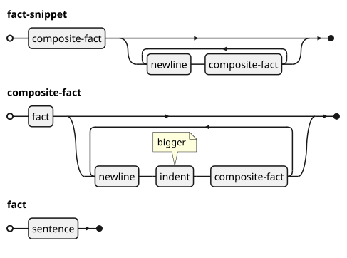

Protonabu consumes *fact snippets*. A fact *snippet* is a sequence of related facts, arranged in consecutive lines, fact per line, in human language *sentence* (or partial sentence) format. 

While specialized *structured* fact line-formats do exist, such as the “labeled fact” format, (used by Protonabu), these structured facts are still facts, which - if crafted carefully - may be interpreted as human language sentences, albeit sometimes exotic, hopefully without being familiar with the underlying syntax. This is not an empty statement! Try feeding any Nabu snippet as "prompt" to an AI agent, and it will interpret it - e.g., generate the implied code in some programming language - at least 90% correctly, without ever hearing about Nabu, or seeing the Nabu schema! (But the difference between the Nabu "prompt" and the common free-text prompt is that the first is deterministic and costs a fraction of the effort to parse, given the Nabu compiler).

Fact snippets are parsed and interpreted one fact at a time. (The first capability - parsing - is provided by the Protonabu parser. The latter capability - interpretation - is the responsibility of the user). The single-fact protocol implies that while the user-provided interpreter may accumulate the facts consumed thus far, it cannot reach the facts that may - or may not - lie ahead. 

The only significant input to the fact parser (besides configuration loaded during initialization) is so many snippets, consumed one at a time. To demonstrate this point, Nabu has no editing commands. In order to edit a Nabu fact base, you must feed it with a - yet another - fact snippet that will (hopefully) leave it in the desired state! (You cannot instruct a Nabu fact-base to change what it knows. But you can present it with additional facts that may - or may not - result in that).

A fact-snippet is *not a fact*; it is a temporary container of facts. A fact does not know which snippet it originated from. The snippet's source, author or technology is not a property of the facts inside. For all we know, two fact bases, in an arbitrary fact language, may have been loaded in a different fact-snippet sequence, yet present identical content.

The physical source that streams the snippet (e.g. disk file, communication socket, memory buffer) has no implication on the snippet’s content, besides giving the snippet a name, and may thus be safely ignored for now. We will return to the subject of fact snippet I/O later.

### 1.2. Composite facts

Some facts are "composite", exposing a hierarchy of sub-facts, *indented* below. While the child facts may still be be evaluated on their own, they also have context. They are located in that special position, indented below a parent fact, in order to “specify” the latter (from “specific” - to fill with detail). 

The degree of indent *ranks* the facts hierarchically. Given the composite fact “A (B, C)”, featuring fact A ranked *one*, and facts B and C ranked *two* below it, one may safely conclude that facts B and C *specify* fact A. But in order to tell whether that assertion is true or false in the problem domain (and what "to specify" means in this context), we need a language interpreter that is fed by the fact tokenizer.

*Example of an unstructured composite fact snippet (where there is no line syntax), specifying the significant capabilities required in order to develop software:*

```text
to develop software // [1]
    to define the requirements // [2]
        to understand need(s) // [3]
        to model the problem domain // [4]
    to design the solution // [5]
        to select architecture(s)
            to make design decision(s)
        to model the solution domain
            to apply design pattern(s)
        to confirm traceability
    to implement the solution
        to code the solution
        to test the solution
        to package the solution
```

*Notes:*

1. Fact ranked 1.
2. Fact ranked 2 (child of "to develop software").
3. Fact ranked 3 (child of "to develop software / to define the requirements").
4. Another fact ranked 3 (child of "to develop software / to define the requirements", sibling of "to develop software / to define the requirements / to understand need(s)").
5. Another fact ranked 2 (child of "to develop software", sibling of "to develop software / to define the requirements").

*Here is an annotated Nabu Pseudocode visualization:*

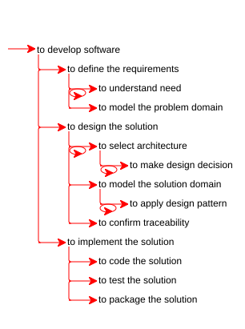

### 1.3. Ranking facts

Ranks are numbered from one. There is no "rank zero" (defining the very reason for the fact base). The definitive fact of the hierarchy is *beyond its scope!* And this is a deliberate design decision. Fact snippets are tokens that may be freely moved within the fact-base and between fact-bases and therefore, do not carry any extra baggage! You can attempt to merge a fact snippet into any fact base that can parse its syntax. The success of the merge may depend upon the facts inside, but there is nothing in the snippet itself that prevents the merge attempt, to begin with (because the snippet does not know where it came from).

The facts in the snippet do not specify their rank explicitly (they do *not start* with the rank number, as in, for example the "hierarchical numbering" visualization, below). The rank is understood automatically by the fact parser. There is no predefined indent: any combination of spaces and or tabs is acceptable, as long as consistent (but consider that, here, tab is expanded to 4 spaces, rather than 8! In case of doubt, and if preparing your fact snippet on an external platform, you had rather configure the platform to issue spaces for tabs). It is your responsibility to make the correct de-dent when retracing ranks. An invalid de-dent (never met above) is in error!

_An “hierarchical numbering” visualization of the original fact hierarchy above:_

```text
1. to develop software
   1.1. to define the requirements
        1.1.1. to understanhierarchicald need(s)
        1.1.2. to model the problem domain
   1.2. to design the solution
        1.2.1. to select architecture(s)
               1.2.1.1. to make design decision(s)
        1.2.2. to model the solution domain
               1.2.2.1. to apply design pattern(s)
        1.2.3. to confirm fidelity
   1.3. to implement the solution
        1.3.1. to code the solution
        1.3.2. to test the solution
        1.3.3. to package the solution
```

The composite fact format lends easily to graphic interpretation, because its simple *hierarchical* structure is a common token in computer graphics. *For example, here is a "functional breakdown" visual of the fact hierarchy above (rendered with Graph-viz):*
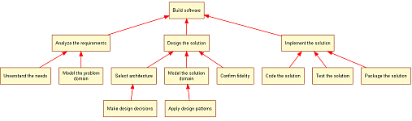

Most commercially available *mind-map* applications will process a fact snippet that follows the description above and display it graphically as per their method.

#### 1.3.1. Layout policies

The default “missing topic” architecture (no fact ranked zero) may pose a challenge, when the fact base indeed encompasses a single topic (which is common, but is neither paramount nor compulsory). The author may address this inherent "limitation" by, for example, the following strategies: (1) a fact base with a *single root* fact, (2) removing the topic of the fact base from the hierarchy, and (3) same as #2, but returning the lost topic through the back door by specifying its detail hierarchy as another root fact. (The latter is the policy taken by Nabu).

##### 1.3.1.1. “Tree” layout

The fact-base features a single rank-1 fact. The sample fact hierarchy above take this approach: The root of the fact hierarchy is "to develop software". All other facts are nested below it and there is no other root fact.

##### 1.3..1.2. “Forest” layout

In this interpretation, the root fact "to develop software" disappears, the three rank-2 facts de-dent to rank 1 and the snippet (e.g. disk file) containing them is named after the missing root fact. *For example:*

_Contents of the fact snippet "developSoftware.facts":_

```text
to define the requirements
    to understand need(s)
    to model the problem domain
to design the solution
    to select architecture(s)
        to make design decision(s)
    to model the solution domain
        to apply design pattern(s)
    to confirm traceability
to implement the solution
    to code the solution
    to test the solution
    to package the solution
```

*Note the following:*

1. “To develop software” is no longer an *explicitly* required *capability* in this problem domain! There is no _fact_ of “Software Development” in our *project* vocabulary. (Precisely: we are now immersed in the “Software Development” universe of discourse, which we are taking for granted, and are delving into its subtleties. Whether this is indeed what we are after is to be debated!)
2. The order has been lost! For all we can see, in this account, “to define the requirements”, “to design the solution” and “to implement the solution”, since not required in order to establish any other fact, are independent endeavors that may be established in any order, including in parallel and in reverse! Since this is obviously not the case (e.g., we are unlikely to implement a solution that is not yet there, in the lack of requirements to define), we must resort to *coupling analysis* in order to infer the order. For example, assuming further analysis of this fact base to reveal that “to define the requirements” shall output “Need Analysis Document” and “to design the solution” shall happen to input “Need Analysis Document” - as demonstrated graphically by the coupling chart visual below -  (and assuming that the identical names indeed suggest the same object), and if no other fact also outputs “Need Analysis Document” (creating a race condition), then we may conclude that the order of facts in the snippet is indeed definitive.

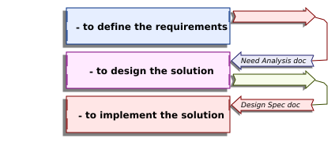

Of course, establishing - or just assessing - the fact of horizontal order by coupling analysis is superior to arbitrary "temporal" coupling. The latter is useful as a preliminary measure, until the data needed for coupling analysis have been established.

##### 1.3.1.3. “Forest with main tree” layout

The properties of the omnipresent topic (that we are immersed in) are specified under a supplementary rank-1 "header" fact hierarchy (e.g., revealing its formal name).

The Nabu syntax implements this third strategy. The domain of this fact base is one “Project” that contains so many “Products”. The snippet features so many facts labeled PRODUCT at rank-1. By default, the name of the folder containing the snippets is also the name of the project, but there is an optional rank-1 fact labeled "PROJECT", which specifies administrative and descriptive properties of the project, and (optionally) pre-declares the products. In this configuration, the fact-base topic’s descriptor and its children occupy the same rank!

*Example:*

```text
PROJECT: Protonabu Usage
    ROADMAP
        INCLUDED PRODUCT: Protonabu Usage Guide
        COMBINED MILESTONE [MAJOR]: My Product
            MILESTONE: My Product - Under Construction
            MILESTONE: My Product - Tested

PRODUCT: Protonabu Usage Guide
    PART: Protonabu
        CAPABILITY: to retrieve registered fact builder
    // ...
```

In this Nabu fact-base, the project (precisely, its header information) and its (child) product are orthogonal on rank-1. Consider that while the project may contain many products, there is only one project, and its explicit specification is optional!

Besides the philosophical aspect, there is also a practical reason for this odd architecture. It gives us the freedom to copy and move products freely among projects, e.g., to export and import products. (Because they are already ranked one). Of course, this copy/paste operation may result in _dangling horizontal references_ (between products), which must be taken care of by the specific language (e.g., "structural completion" in Nabu).

### 1.5. The"Labeled Fact" format

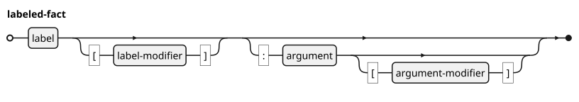

"Protonabu" is a specialized composite-fact language, where all facts, without exception, are *labeled*.

*A Protonabu Labeled Fact consists of 1-4 parts:*

1. **Label**
   1. Optionally followed by **label properties** in *square brackets*.
   1. Optionally followed by *colon* and **argument**
      1. Optionally followed by **argument properties** in *square brackets*.


Typically (but not necessarily), the label specifies the *type* (e.g., syntactical role) of the fact and the argument, if present, gives it a *name.* The properties, if present, *narrow the scope* of the label and/or the argument. (For example, making the argument optional or repetitive). There is no need to squeeze additional complexity to the labeled fact (for example, to add a property that narrows the scope of a property). This is what the hierarchy below is for!

*For example:*

```text
CAPABILITY: to find first greater or equal entry // [1]
    IMPLEMENTATION [METHOD] // [2]
    OUTPUT [OPT ""]: "found entry" // [3]
```

*Notes:*

1. A fact expressed by label ("CAPABILITY") and argument ("to find first greater or equal entry").
2. The label of this fact is modified (by "METHOD"). This fact has no argument (and therefore, no colon). The name of the method (the would-be argument) is left to be generated by default
3. The label of this fact is modified (by the fact of it being optional - by default: the empty string).
   - Note that although [OPT: ""], featuring colon, would be more readable (repeating the parent pattern), I have selected not to use colons inside modifiers, to prevent the rise of a composite structure within the fact line. As stated above, the correct way to express hierarchy is through the available indented fact hierarchy. The labeled-fact format, by explicit design decision, does not support a “composite fact property” that opens a square bracket in one line and closes it some lines below, exposing a multi-line sub-hierarchy.

*About capitalization:* In Protonabu literature, labels (as well as keyword arguments and  property modifiers) are *emphasized* in all-capital letters. This practice is compliant with the output of the Nabu *restorer* (what you get when you *save* a Nabu design). However, writing labels in all-capital letters is just a convention (as for example, in SQL literature). The Protonabu tokenizer is generally case-insensitive and will accept labels and keywords in any case combination!

### 1.6. Protonabu Parsing

In a Protonabu-powered language, the available labeled-fact vocabulary - as well as the allowed fact hierarchy and property syntax - is pre-defined. The labeled fact syntax is specified in a *Protonabu Schema* - a (Protonabu) snippet used to configure the parser.

The Protonabu parser tokenizes labeled facts one by one and feeds each, *in the same order,* to a user-provided parser (typically, a call-back method of the fact-base builder for the particular language-engine that commissioned the Protonabu parser). The parser is first set up with the following:

1. A _Protonabu Schema_ (a Protonabu snippet, whose own schema is unique and hard-coded), specifying the vocabulary of labels available in the language, their hierarchy and the tokenizers for their arguments and modifiers (the latter are referenced by name, but their implementation tokenizer functions are provided by the user).
2. A Python object (class instance or module) that exports the functions that interpret labels and tokenize label arguments and their modifiers. The registered label-parser receives an object that contains the tokenized fact, the label path and the original location in the snippet (for use in error messages). Auto-registering the label parser follows a simple naming convention. E.g., for the label “INFO”, the builder is expected to have the method “parseInfo”.
   1. Note that label parsers are retrieved by discrete label, rather than by label path! For example: both “PRODUCT / INFO” and “CAPABILITY / INFO” reach the “INFO” parser, using the path as argument. The label parser shall be capable to handle all possible paths to the label! Consequently, the generic Protonabu parser does not guarantee that the specific label has indeed been interpreted (because a poor label parser may miss it)!


The Protonabu parser verifies that all required label and argument tokenizers are indeed provided, even if never used! (For the simple reason that snippet consumption is - for all we know - accumulative and non-deterministic, and we have no way of telling whether the fact base being built is indeed final).

Having built the schema AST and registered the label parsers and argument tokenizers, and provided a Protonabu _snippet_ (e.g., fed from a disk file), the Protonabu parser engine proceeds with a two-pass procedure:

1. First, the Protonabu parser tokenizes the facts in the snippet, one at a time, into an interim AST.
   - The Protonabu tokenizer does not look ahead beyond the *present* line.
   - In addition to proper facts, the Protonabu tokenizer also consumes _immediate_ pseudo-facts (acting as "parser directives", e.g., *importing* child snippets). Parsing directives are not facts; they are interpreted immediately (during the first pass, by either the Protonabu tokenizer itself or the specific language parser, as configured). This does not add considerable noise. There is only a single immediate fact that is handled by the generic Protonabu tokenizer, and its use is strictly optional. (Four more Nabu-specific parsing directives are handled by the Nabu parser).
   - The Protonabu tokenizer validates the labeled fact hierarchy, argument and modifiers against the provided language schema. It also uses the specific language-parser-provided tokenizers to (already) tokenize the argument and modifiers, as specified in the schema. (This functionality is not specified internally in EBNF, although, in principle, it could). On failure, the Protonabu parsing engine aborts the parsing, reporting the error message, the offending snippet name and line number.
2. Then, the Protonabu parsing engine scans the cached AST, invoking - for each fact - the provided specific language parser method, using the tokenized argument and modifiers.
   - When a fact sub-hierarchy (of any depth) terminates, the appropriate end-fact parser method (if provided) is invoked. This allows the language parser to transcend the simple single-line paradigm by caching accumulated facts and evaluating them in bulk, handling the parsing of non-hierarchical facts, or validating and tidying a complex structure that may feature optional parts, preventing the overhead of scaffolding, where necessary.
     - Consequently, although parsing the fact snippet is done one fact at a time and without lookahead, it is not entirely stateless, since the specific language parser is allowed to manage the state of the current hierarchy (or nested hierarchies) in the current snippet.
   - But once the snippet is consumed, all open fact hierarchies are finalized and the design fact base is open for browsing and/or extension (by the next snippet in line).
   - If the client language parser fails, the Protonabu parsing engine aborts the process, reporting the error message received from the specific language parser and the offending fact’s snippet name and line number (which are recorded in the AST).
3. Precondition for all this is that the Protonabu parsing function blocks the fact base: (1) the fact parser does not read two snippets in parallel, (2) the parser is not commissioned to parse in parallel with another parser (for the same fact base), and (3) the fact base API does not respond to queries while a snippet is being consumed. Otherwise, the results are undefined.

The fact snippet protocol guarantees the following pre-conditions for the language parser (in snippet context):

1. In a non-empty fact snippet, there shall be a rank-1 fact to begin with. A snippet will never start “from the middle” (which is a parsing error).
2. A composite fact is guaranteed to terminate (and we know exactly where). A snippet will never end abruptly. (And even if it physically does, the Protonabu parsing engine closes it automatically).

### 1.7. The "Fact Path"

The *meaning* of fact labels (in the respective Protonabu powered language) is relative to the hierarchical *context*. While the same label may be found under different parent labels in the fact hierarchy, in each case it may be assigned a different meaning. Precisely: The meaning of a label is determined by the *path* to it!

```text
PRODUCT: Comm Client Library
    INFO ["Description"]: Inter-process/thread comm using point-to-point message queues
    PART: Comm Client
        INFO ["Purpose"]: A singleton provider of message queues
        CAPABILITY: to enqueue request from the Server
            INFO ["To do"]: Validate that the request has indeed arrived at the server!
```

In the example above, the label "INFO" specifies facts of three different types ("PRODUCT", "PART" and "CAPABILITY"). Apparently, with the same vague (polymorphic) meaning - an unstructured informative item added to the bullet dictionary of the parent fact (whatever it may be, and assuming it has one).

Facts are introduced to the design for either of two objectives: (1) to specify a fact on what is above (naturally) and (2) to establish the fact path for what is going to be specified below, allowing controlled *redundancy*. The latter feature is less intuitive, but is not unique to Nabu. It is typical of dictionary-based languages in general (for example, JSON configuration files. Indeed, most - though not all - Nabu design entities introduced following a fact label, physically sit in a - global or local - dictionary!). To make a long story short, inserting a value to a dictionary, given key, overrides the value associated with the key if already exists, otherwise enters the key and the value, and silently ignores the request, if both already exist as stated.

In Nabu, which has no editing API, path redundancy is used as an editing tool. Every nested labeled fact entered establishes the current *fact path.* Consider for example, this three-fact design:

```text
PRODUCT: Comm Client Library
    PART: Comm Client
        CAPABILITY: to enqueue request from the Server
```


The path to the third fact is "PRODUCT / PART / CAPABILITY". (Read: "CAPABILITY" in "PART" context, which is in "PRODUCT" context). The “floating slash” operator (surrounded by spaces!), separating familiar labels, is used to express a label path. So, this has been the *type* of the path. And then, the *value* of the path is "Comm Client Library / Comm Client / to enqueue request from the Server". The latter (path value) is less restrictive than the first (path type). While fact paths are always typed (since there is no such thing as label-less fact in Protonabu), they do not have to be fully valued. In the above example, all facts are uniquely named. However, some labeled facts are not uniquely-named (for example, being unique in their context only), and some are not named at all (and just *accumulate* some facts - or fill the only such available slot for their type - in the parent context).

There are preconditions for controlled path redundancy. Only design facts that define *named* design elements that are unique (either globally or in the present context), or are unnamed but *singular* (the context tolerates at most one instance of the fact), are allowed to be redundant. In these cases:

1. If the design fact does not exist, it is added.
2. If the design fact exists under a different name but was _established by default_ (e.g., “structural completion” in Nabu), it is renamed (and/or redefined hierarchically, as applies).
3. If the design fact exists under a different name but was not defined by default (or definition by default does not apply to this label) - error!
4. If the design fact exists under the same name, the redefinition is ignored. But it is not useless, having established the *fact path* for the design hierarchy to come below! Consequently, one can specify the same composite fact multiple times, with each duplicate specification accumulating additional detail (or just ignored). This controlled redundancy is a crucial aspect of the Protonabu *snippet* protocol, to be discussed below.

*For example:*

```text
// this design...
PRODUCT: Comm Client Library // [1]
    PART: Comm Client // [2]
        CAPABILITY: to enqueue request from the Server // [3]
    PART: Comm Client // [4]
        CAPABILITY: to send request to the Server // [5]
PRODUCT: Comm Client Library
    PART: Comm Client
        CAPABILITY: to receive response from the Server
//
// ...is identical to this design:
PRODUCT: Comm Client Library
    PART: Comm Client
        CAPABILITY: to enqueue request from the Server
        CAPABILITY: to send request to the Server
        CAPABILITY: to receive response from the Server
```

*Notes:*

1. This fact adds a PRODUCT named "Comm Client Library".
2. This fact adds a PART named "Comm Client" to the product "Comm Client Library".
3. This fact adds a CAPABILITY named "to enqueue request from the Server" to the part "Comm Client" (of the product "Comm Client Library").
4. This fact is redundant and does not affect the fact base. Still, it serves to establish the path type "PRODUCT / PART" with path value "Comm Client Library / Comm Client".
5. This fact adds a CAPABILITY named "to receive response from the Server" to the part "Comm Client" (of the product "Comm Client Library").

As stated above, fact redundancy applies only to *uniquely-named* and singular facts. On the contrary, non-unique facts, such as facts that just *append* an unnamed element to a list, will always attempt to do just that, and may not necessarily establish a useful fact path, depending on context! Of course, a duplicate non-unique fact, being context-dependent, *may* result in error!

*For example:*

```text
PRODUCT: Comm Client Library
    PART: Comm Client
        CAPABILITY: to enqueue request from the Server
            IMPLEMENTATION: enqueue
    PART: Comm Client
        CAPABILITY: to enqueue request from the Server // [1]
            IMPLEMENTATION: pushRequest // [2]
```

*Notes:*

1. This fact establishes the path.
2. But this duplicate fact is in error. According to the rules of this Protonabu language ("Nabu"), a capability may have at most one named IMPLEMENTATION, (and this one is already named)!

*However, the following duplicate METHOD fact is used properly:*

```text
PRODUCT: Comm Client Library
    PART: Comm Client
        CAPABILITY: to enqueue request from the Server
            IMPLEMENTATION: enqueue
    PART: Comm Client
        CAPABILITY: to enqueue request from the Server
            IMPLEMENTATION // [1]
                ACCESS: PRIVATE
```

*Notes:*

1. But this duplicate fact is used to insert a child fact property below ("ACCESS").
   - Note that, due to the limitation of the indent medium, you *cannot skip* the IMPLEMENTATION interim level. But since the properties of the implementation label are optional, and since the IMPLEMENTATION is singular, the name may be skipped, to allow redundancy-free maintenance.


Incidentally, design-path redundancy enables an infamous Protonabu "bug". (Well, it will be uninteresting to introduce a new programming language that does not allow for any bugs whatsoever)! Copying the fact path with a typo (or changing it manually, missing an occurrence), is likely to give birth to a new fact (by the mistyped name), rather than add to the intended fact. Sorry, the Protonabu parser will not prevent you from doing that. Watch your step!

### 1.8. Continuation and comment pseudo-facts

For technical reasons, not all lines in the fact snippet indeed specify *facts!* We have already mentioned parser directives. In addition, there are two line *prefixes* that control the process of parsing, and the rest of the line following them does not relate a discrete fact: (1 Continuation line, and (2 comment. (These prefixes _are not_ labels!)

#### 1.8.1. Continuation line

```text
CONTAINS [0-N:1 BY REFERENCE]: Composite Fact
    INFO [PURPOSE]: The Nabu Composite fact view publisher
    - The Project, a Product, a Part, a Use case etc.
    - Typically indicated by the current Project Tree entry
```

Ideally, each fact in the hierarchy should occupy exactly one line. However, very long facts (typically user-defined free-form descriptive items and citations) may have to be broken to a number of consecutive lines, for the purpose of clarity or due to technical restrictions (such as edited line length). Hence, the need for continuation lines. Lines beginning with "- " are considered as continuation of the line above (which must be of the same rank!). Since a continuation line is *not* a fact, its content is unceremoniously appended to the line above (which is the fact). The (non-)fact of continuation is lost! When Nabu saves the design, the line that was glued together may - or may not - be broken to continuation lines arbitrarily, as configured!

#### 1.8.2. Comment

```text
USE CASE: to initialize the main frame
   REQUIRES: To initialize the main panel // Constructor
   REQUIRES: To load controls on the main panel
       REQUIRES: To initialize action button A
       REQUIRES: To add action button A to the main panel
   // etc. ...
```

Any text that follows the "//" (double slash) symbol (unless within a quoted string literal) up to the end of the line is considered as *comment*, and is *ignored*. Comments are for the author's one-time convenience only (for example, the comments in the examples brought in these tutorials) and are not recorded in the fact base!

If you must attach persistent descriptive items to some fact, use the appropriate child facts, if - and as - provided by the specific language, to annotate it. (For example, Nabu “PROPERTY” and "BULLET" facts).

### 1.9. Protonabu Parser Directives

- END: &lt;SOME LABEL ABOVE&gt;

The <b>END</b> pseudo-fact is optionally used to explicitly terminate a long fact sub-hierarchy (as compensation for the cognitive load of the indent-based layout).

The existence of a parent label (at the same rank above) *is* validated! (But its name is not. It is common practice, e.g. by the Nabu restorer, to add the instance name as inline comment).

This common immediate pseudo-fact is handled directly by the generic Protonabu label-parser.

For example, the Nabu restorer inserts an END pseudo-fact automatically for fact sub-hierarchies that exceed 10 lines (which is configurable).

```text
    USE CASE: to build the rest of My App
        TITLE: Building My App
        REQUIRES: to prepare My App snippet
            REQUIRES: to edit My App snippet
                REPEATED [UNTIL]: "The DSL spec is stable"
                REQUIRES: to add Fact to My design
                    ALTERNATIVE: "Learning"
                        CRITERION
                    REQUIRES: to position Fact in my design
                    REQUIRES: to state my Fact
                REQUIRES: to modify my Fact
                    ALTERNATIVE: "Improving"
            REQUIRES: to compile My App snippet
        END: REQUIRES // to prepare My App snippet
        REQUIRES: to design and build my other functionality
        REQUIRES: to design and build My user interface
    END: USE CASE // to build the rest of My App
```

### 1.10. Protonabu edit indicator

There are three postfix tokens that may *trail* facts, with the intention of overriding their default handling (by the user-provided interpreter):

1. “INCOMPLETE ”(indicated by ellipsis). Indicates to “structurally complete” the fact and its consequences.
2. “FORCED” (indicated by double exclamation mark). Indicates to accept the implied changes of the fact “by brute force”.
3. “OBSOLETE” (indicated by double hyphen). Indicates to delete the fact and its children from the fact-base.

For concrete examples, see the Nabu User Guides. 

The Protonabu tokenizer inherently recognizes the `...`, `!!`, and `--` space-separated postfixes and maps them to an enumeration, passed on, as part of the tokenized fact. Deciding what to do about it (typically, to modify the DOM under construction) is the business of the client interpreter. 

Oops, wait a minute! One may wonder: why would a fact language allow *facts that contradict facts?* If the fact in line 95 contradicts the fact at line 47, so that the latter must be removed from the fact base, then one may ask why bother with the ("wrong") fact at line 47 in the first place?! Allowing to state facts, knowing that they may (turn out to) be wrong seems to defy the very notion of fact and facts! Well, it does indeed, in a static fact-base that is never edited. But in the real world, the knowledge in an established fact base may be augmented - or reduced - by additional snippets, accumulating fresh knowledge. 

These indicators are primarily used during editing sessions, or when generating facts automatically, such as from Nabu "Design Idiom" templates, in order to instruct the client interpreter logic to apply structural completion, forced modifications, or removals transparently. (Consider that Nabu has no editing API. It only understands facts).

(Anecdotally, because Protonabu parsing is oblivious to the distribution of facts among snippets, it accepts the existence of mutually-contradictory facts in the same snippet, although this is questionable design).

### 1.11. The \"Fact Snippet\" protocol

The Protonabu API is fed by fact snippets, streaming design facts in, *one at a time*. (The Protonabu parser looks exactly one line ahead and no more!) 

*Three common Protonabu snippet types are:*

- **File snippets**. Streaming facts from a file. The file may be arbitrary long, because it is read one line at a time (it is not explicitly buffered by the snippet).
- **Text snippets.** Used internally, for example to store meta-design-generated facts and to marshal objects between server and client. For example, a drag and drop operation is translated by the Nabu client UI to a snippet that will establish the desired new state, and this is sent to the Nabu server (that knows nothing abut visual objects and edit operations).
- **Socket snippets.** Used internally to marshal Nabu objects over the network. E.g., peer contributions.

The current snippet type is not a fact! (I.e., you are not supposed to learn anything about a fact from the name of the snippet which brought it or from the non-fact that it came over the network). The snippet input protocol is polymorphic, in fact, consisting of only 1) file name and 2) raw-fact (i.e., line) *iterator*.

### 1.12. Cascading fact snippets

A Protonabu snippet is more than just a flat sequence of facts. It may *import* child snippets, specifying file address (in the project’s file system or elsewhere), resulting in a cascading snippet structure. For example, in Nabu, there are these importing scenarios:

1. To import the specification of some third party Nabu library *used* by the project, so that its parts and capabilities (representing the third party library’s classes and functions) may be explicitly required by the design, designated as “infrastructure”. An obvious example is the standard library of the target programming language. 
2. To silently import the current specification of each *product* in our project. The Nabu restorer stores each product in a separate file in the *products* folder and inserts INCLUDED PRODUCT pseudo-facts to reload them in the PROJECT header.
3. To import the abridged Nabu "interface" of products from neighboring projects.
4. To silently import the various Nabu snippets generated as the result of DESIGN IDIOM template expansion. 

As the Protonabu parser reads a tokenized snippet, it recurses into its child snippets. But, unlike similar "import" directives in some programming languages, 1) the child snippet is not evaluated immediately at the point of the parser directive and 2) its contents may not be arbitrary. A Protonabu snippet must start at rank 1 and all its pending composite facts are automatically terminated upon exit. 

## 1.13 Snippet adapters

Protonabu is capable of registering *snippet adapters* per file extension (e.g., ".json"). A snippet adapter is meant to convert Protonabu snippets to and from compatible hierarchical formats (e.g., Markdown, JSON, XML), transparent to the Protonabu and particular-DSL engines.

*Example: Markdown Protonabu adapter:*

*Nabu format:*

```text
PROJECT: Infrastructure
    PRODUCT: Configurator Package
        USE CASE: to add table entry
            WHEN [PRE "table empty"]: ESCAPE [DONE]
                REQUIRES: to insert first entry to table
            REQUIRES: to find first greater or equal entry
                USING: "value to insert"
```

*Markdown format:*

```text
- PROJECT: Infrastructure
    - PRODUCT: Configurator Package
        - USE CASE: to add table entry
            - WHEN [PRE "table empty"]: ESCAPE [DONE]
                - REQUIRES: to insert first entry to table
            - REQUIRES: to find first greater or equal entry
                - USING: "value to insert"
```

*The above, rendered as Markdown:*

- PROJECT: Infrastructure
  - PRODUCT: Configurator Package
    - USE CASE: to add table entry
      - WHEN [PRE "table empty"]: ESCAPE [DONE]
        - REQUIRES: to insert first entry to table
      - REQUIRES: to find first greater or equal entry
        - USING: "value to insert"

*Example: XML Protonabu:*

```xml
<nabu>
  <project argument="Infrastructure">
    <product argument="Configurator Package">
      <use_case argument="to add table entry">
        <requires argument="to find entry">
          <using argument="&quot;value to insert&quot;" />
        </requires>
      </use_case>
    </product>
  </project>
</nabu>
```

## Chapter 2. Creating a Protonabu-based DSL

The `Protonabu` infrastructure offers a schema-driven environment allowing a software developer to define DSLs (Domain-Specific Languages) with robust parsing characteristics. We propose here an elaborate registration-based parsing process that does the job and does it reliably. Of course, it remains possible to address Protonabu low-level API in order to build ad-hoc snippet interpreters resorting to line-by-line parsing and tokening. But this is not explained here, because developers that are fond of that do not need technical manuals anyway! The proposed proper way is to subclass `ProtonabuParser` in order to implement strict grammatical rules mapped transparently to event-driven execution flow.

Key benefits of using a schema-driven Protonabu parser:

1. **Safety and Maintainability**: Hand-rolled string parsers are fragile. Hard-coded string matching makes extending the language difficult, and the interpreter code naturally degrades into spaghetti structure as more edge cases are added. Delegating syntax validation and hierarchy to the `ProtonabuSchema` guarantees that input conforms to structural expectations before programmatic execution ever begins.
2. **Strong Typing**: Because the parser uses granular tokenizers, the arguments provided to specific instructions are typed out-of-the-box. Thus, a string is recognized precisely as `quotedText`, a generic keyword as `unquotedName`, to name a few.
3. **Event-driven Execution**: Execution models built over Protonabu utilize a `Dispatcher` mapping language statements directly to parser callbacks. This separates grammar representation from business logic.

------------------

*Contents:*

1. Defining the Schema
2. Documenting Protonabu Schemas
3. Optimizing duplicate hierarchies
4. Hooking the Dispatcher into execution

### 2.1. Defining the Schema

<i>Syntactic feature:</i> Defining the `.facts` schema configuration specifying your DSL's hierarchy and the tokenizer libraries it uses.

<i>Intent:</i> The schema file acts as a rigid, text-based contractual layout. Protonabu expects exact hierarchical definition before interpreting input facts under it.


A Protonabu fact consists of label, label modifier, argument and argument modifier in this order, where the last three are optional. The label is part of the fact hierarchy. The optional argument and modifiers must be predefined using tokenizers. 

For convenience, many essential syntactic tokenizer “basic types” are supplied inside the `factParser` module (powered by the `pyparsing` package). In addition, user-defined parser projects typically add their private syntactic abstraction level, e.g., the `nabuFactSyntax` module in the Nabu project. These type-defining tokenizers are mapped by name by the parser and invoked to tokenize the values, as they come.

*For example, here are a number of predefined tokenizers for file name and file path, powered by pyparsing:*

```python
from pyparsing import (
    Word,
    CaselessKeyword as Kwd, # Label and keyword parsing is case-insensitive
    Or,
    ZeroOrMore,
    OneOrMore,
    Optional as Opt, # to prevent ambiguity with Python's own typing module
    ParseException
)
# ...
fileName = OneOrMore(Word(wordLetters + '.'))  
tokenLegend[fileName] = """
sequence of words, each consisting of lower-case, upper-case, digit or the symbols _, -, +, #
"""
fileSeparator = Or(
    [Word(x, exact=1) for x in separators]
)
pathName = (
    Opt(
        Word(lowerCase + upperCase, exact=1) + colon
    )
    + Opt(fileSeparator)
    + ZeroOrMore(fileName + fileSeparator)
    + Opt(fileName)
)
tokenLegend[pathName] = r"""
Sequence of file-names (see item), separated by / or \ and optionally preceded by lower-case or upper-case followed by colon and/or the file separator / or \
"""
quotedPathName = Or((
    dQuote + pathName + dQuote,
    sQuote + pathName + sQuote,
    pathName
))
tokenLegend[quotedPathName] = r"""
Sequence of file-names (see item), separated by / or \ and optionally preceded by lower-case or upper-case followed by colon and/or the file separator / or \ and (the whole) optionally enclosed within single or double quotes
"""
```

*Referenced here:*

```text
FILE NAME: quotedPathName // Where to find it on the disk.
```

The use of the `pyparsing` infrastructure is not obligatory! Due to Python’s  “duck typing”,  any object that responds to `parseString` (that takes a string and returns a list of string tokens) can serve as a tokenizer. (At the expense of loosing the provided `pyparsing`-based "basic-type" lexicon). *Example:*

```python
class UnstructuredText:
    """ Unstructured Text
    """
    @staticmethod
    def parseString(s: str, parseAll:bool=True)-> list[str]:
        """ to parse string
        """
        return s.strip().split()
unstructuredText = UnstructuredText()
tokenLegend[unstructuredText] = """
Any combination of Unicode characters, up to end of line
"""
```

*Referenced here:*

```text
REASON: unstructuredText // The reason for it (everything goes!)
```

The content of the line following the label arrives at the user’s parser engine already tokenized and verified. (If one of a token fails tokenization, e.g., non-numeric where number is expected, or not fulfilling the specified format), the parser will exit with `ParseError`, quoting file name, line number, and the name of the invalidated token. 

Although line contents is tokenized in advance, the user’s parsing engine receives the tokens in sequence. What to do with the sequence is the user's responsibility. This may involve some duplicate functionality, e.g., where the user intends to now parse the tokens into an AST (Abstract Syntax Tree) branch. In that case, although the tree tokenization has already been performed (by the tokenizer), the user gets a flat token sequence. Consequently, it is customary to enhance the tokenizer library with “parse” functions for widely used non-trivial tokens, which consume a tokenized sequence (precisely: an iterator) and produce the expected data structure for use by the label parser (example below).

### 2.2. Optimizing repeated schema subroutines

An hierarchical structure is made out of sub-hierarchies and it is not uncommon to find exactly the same sub-hierarchy used in different contexts. Obviously, we do not want to repeat the definition up to the last detail, wherever the hierarchical pattern is repeated. 

Protonabu schemas offer the `__DITTO__` label as an intentional macro directive mapping an entire defined subtree into a child node recursively without duplicating raw grammar specification lines. 

*For example:*

```text
STRUCTURED NARRATOR: uniqueEntityName
    COMPONENT NARRATOR: uniqueEntityName
        HEADER
            NEXT: text
            PRINT: text
        FOOTER
            __DITTO__: STRUCTURED NARRATOR / COMPONENT NARRATOR / HEADER
```

In this case, `FOOTER` transparently inherits the `NEXT` and `PRINT` sub-facts. 

Note that while the DITTO pseudo-fact indeed references the subtree as is (it does not copy it), the line above it (its “parent node”), which is not part of the dittoed block must be syntactically complete. Thus, in the following example, we must copy the complete SECTION signature, although identical! If the second branch was to only consist of unadorned SECTION, the rest of the line would not be miraculously restored!

```text
DOCUMENT: uniqueEntityName
    CHAPTER: quotedText
    	SECTION [hierarchicalNumber]: uniqueEntityName [caption]
    		PARAGRAPH [header]: text
    		PICTURE: filePath
    APPENDIX: quotedText
    	SECTION [hierarchicalNumber]: uniqueEntityName [caption]
            __DITTO__: DOCUMENT / CHAPTER / SECTION
```

Protonabu actively prevents infinite graph cyclic behaviors within the AST. It accepts *transitional* recursion. It is legitimate to *ditto* under a schema node a subtree that - inside - references the very dittoed node. The schema will stop right there (and will not recurse forever). Of course, do not ditto a node *directly* under itself (which makes no sense)! 

### 2.3. Documenting the Protonabu Schema

One of the vital benefits of schema-driven architecture is automatic documentation synthesis. Trailing comments in the Protonabu schema `.facts` file are not ignored! They are actively consumed to generate a syntax specification document. The utility function `reportSchema()` in the `reportSchema` module, which generates a user-guide-ready markdown report, uses the following sources to build the documentation:

1. The Schema AST.

2. Labeled line documentation - the trailing double-slash `//` comments stored in the schema AST.

3. Line tokenizer documentation - notes stored in a (user-defined) dictionary (which must be) called `tokenLegend` searched for in the tokenizer definition modules (there may be more than one - e.g. the provided default library and one or more user-defined addendum libraries). *Example:*

   ```python
   associationQuantityAndStrength = Or((
           associationQuantity + Opt(associationStrength),
           associationStrength
       ))
   tokenLegend[associationQuantityAndStrength] = """
   Association quantity followed by either BY VALUE or BY REFERENCE. The association quantity consists of source-role quentity, followed by colon followed by target-role quantity, where the source-role quantity is optional (defaulting to 1). Each role quantity consists of two positive numbers (or N) separated by hyphen/comma or a single number (or N) when the two are identical
   """
   ```

This allows developers to maintain language reference documentation natively within the syntax definition itself. The resulting markdown file will list both the hierarchical label structure and the line-tokenizer structure in both text and graphic EBNF formats. (The latter depends upon the existence of the “plantUml” program on the machine).

To obtain a comprehensive EBNF-annotated account of your DSL (e.g., to include in your user manual), use `reportSchema()` from the `reportSchema` module.

*Example schema documentation detail from the enclosed demo-application:*

### <u>BOOK</u>

- *Argument:* Quoted Name - Sequence of words, beginning with programmatic, allowing round brackets (around one or more whole words) and (the whole) optionally enclosed within single or double quotes
- *Child facts:*
    - AUTHOR
    - VERSION
    - DATE
    - LOGO
    - CHAPTER


### 2.4. Hooking the Dispatcher into Execution

<i>Intent:</i> Hooking programmatic logic cleanly to the successfully parsed schema fact tree.

You connect your schema-driven grammar to implementation via the `ProtonabuParseDispatcher`.

When your subclassed `ProtonabuParser` executes `self.parseLines()`, the internal state engine traverses the Nabu snippets and locates dispatch hooks matching the canonical string title defined in the `Schema`. 

<i>Preferred Integration:</i> Just supplying the library subclass is usually enough! By simply calling `dispatcher.loadHandlers()`, it will automatically discover all parsing methods that are named properly, mapping to schema labels! (E.g., the label “PROPERTY” looks for the parsing method `parseProperty`). Where the parsing method names do not map to the label trivially, you can still register them manually, using `registerHandler`.

During execution callbacks, Protonabu supplies the exact parser state contextualized dynamically inside the `fact.designPath` argument representing its exact placement within the AST execution flow graph. Every parser usually begins by unwrapping the context:

```python
    def parseLoop(self, fact):
        """ to parse LOOP instruction """
        parentLabel, parentNode = fact.designPath[-1]
        # Extrapolate syntax values directly!
        modifier = fact.getLabelModifierAsText(isToUnquote=True)
        argument = fact.getArgumentAsText(isToUnquote=True)
        inst = MyDSLInstruction("LOOP", modifier=modifier, argument=argument)
        if parentLabel == 'COMPONENT NARRATOR':
            parentNode.program.append(inst)
        else" # 'LOOP'
            parentNode.block.append(inst)
        return inst
```

*The importance of the “Fact Path”:* It is well possible that the SAME label has different semantics (as well as subtrees) under different paths. For example, `"BANK / BRANCH"` versus `"TREE / BRANCH"`. But Protonabu is completely oblivious to this semantics! Therefore extracting the `parentLabel` inside the parser method using `fact.designPath` provides the explicit context selection needed to safely process identically-named labeled facts. Inside the ambiguous parser method, proceed with match/case logic! 

Actually, the `TokenizedFact` object passed to the parsing method contains much more than just the fact path. It also contains the file name and line number, token sequences of the argument, label modifier and argument modifier, and even the original strings, if your need them. The tokenized sequences are supplied through statefull iterators (that keep the last-consumed token): an optional instance for the argument, and iterator arrays (that may be empty) for the modifiers. The modifiers provide iterator arrays (rather than an optional instance), to support the rarely-used feature of multiple values (separated by semicolon) within the square brackets. 

For trivial cases, the user’s parsing logic may use the interface to simply retrieve the argument, (first) label modifier and (first) argument modifier, if any, as a flat strings, optionally stripping (double or single) quotes., as in the example above.

```python
argument = getArgumentAsText(isToUnquote=True)
```

While the arguments following the label are tokenized in the first pass, the user’s parsing engine receives them, in the second pass, as sequences of tokens in the correct order, but not in hierarchical AST (Abstract Syntax Tree) form. Building the AST structure, where required, is the responsibility of the user (although it may require repeating some tokening logic). Where the actual parsing requires more than just flattening the token-list to a string, as in the example above, it is customary to enhance the user’s tokenizer library with “parse” functions that consume the tokenized sequence iterator and produce e.g., a structured tuple list or data-class result for use by the parser (rather than duplicate the same functionality at point of use).

For example, the following mini-parser extracts so many “path” elements, separated by floating slash:

```python
def parseDesignPath(itr: TokenListIterator)-> list[str]:
    """ to parse design path
    """
    result = []
    for token in itr:
        if token == '/':
            result.append('')
        elif not result:
            result.append(token)
        elif result[-1]:
            result[-1] += ' ' + token
        else:
            result[-1] = token
    return result
```

### 2.5. Passing State Down the Tree

<i>Intent:</i> Making parent objects available to sub-facts downstream via the hierarchical parsing path.

A useful property of the Dispatch Engine is that the returned execution result of a parser method is automatically cached into the traversal path. Thus, your parser method may return an **arbitrary object**, which will then become seamlessly available to its parsed children via their local `fact.designPath`.

Consider a simple - `TABLE` label with nested `ROW` labels - schema. In your implementation, the `TABLE` parser method initializes the foundational table object representing that block and **returns** it. Then, as execution flows deeper into the schema and invokes the descendant `ROW` parser, it extracts the initialized table object explicitly from its parent node tuple, creating the row object and inserting it correctly into the statefull active table dynamically!

```python
class TableParser(ProtonabuParser):

    def parseTable(self, fact):
        """ to parse TABLE instruction
        	- Input: Tokenized Fact with path
        	- Output: Table Object
        	- Output ["State"]: Table object in path, available for row parser 
        """
        # [Msg]: to begin Table in Document
        return self.document.beginTable()

    def parseRow(self, fact):
        """ to parse nested ROW instruction 
        	- Input: Tokenized Fact with path
        	- Input ["State"]: Table object at to pof path 
        	- Output: Table-Row Object
        	- Output ["State"]: Table-Row object in path, available for cell parser 
        """
        # to retrieve the parent Table from the Path
        parentLabel, parent = fact.designPath[-1]
        row = fact.getArgumentAsText(isToUnquote=True)
        # [Msg]: to add Row to Table
        return parent.addRow(row)
```

By safely treating Nabu nodes as active programmatic scopes, hierarchical object-oriented aggregation is managed sequentially!

### 2.6. Handling hierarchical fact end-parsing

When a fact hierarchy is closed (returning to the original rank) the label end-parser (if provided by the user) is invoked, using the object being built. This allows to - for example - tidy complex objects in bulk, instead of repeating the (potentially expensive) tidy operation after each internal entry. Of course, this is based upon the assumption parsing the snippet is blocking the fact base to queries!

```python
    def parseUseCaseEnd(self, fact: TokenizedFact) -> Optional[Any]:
        """ to parse use case end
        """
        parentLabel, parent = fact.designPath[-1]
        # [Msg]: to tidy up Use Case structure
        if hasattr(parent, 'useCases') and parent.useCases:
            parent.useCases[-1].tidy()
        return None
```

### 2.7. Deferred Validation via Snippet Exit Validators

While the end-parse-handler takes care of properly terminating the current hierarchy, a Validator does it in snippet scope. During snippet parsing, you may need to validate relationships or properties that span multiple facts unhierarchically, or verify structure that can only be confirmed once the entire snippet tree has been parsed (where the "parse-end" hook may suffice). (Admittedly, this compromises the snippet into a "fact" of sorts, being a "scope of truth"). For example:
- Verifying that an alternative list (`ALTERNATIVE` facts) contains more than a single option (which would otherwise be converted to a simple `OPTIONAL` condition).
- Kind of "lookahead" (in retrospect). Resolving forward-referenced milestones to ensure they refer to actual milestones defined elsewhere in the snippet or prior.

Because these validation checks depend on information that might only appear later in the snippet (or in another imported snippet), validating them immediately during the event dispatch of a specific label is impossible or premature.

To address this, the `ProtonabuParser` base class provides a deferred validation facility via **Exit Validators**.

#### 2.7.1. Registration Interface

The parser provides two methods to manage deferred validation:

*   `registerExitValidator(self, obj: Any, validator: Callable[[Any], None])`: Registers a validator callback function for a specific object. The validator will be invoked at the end of the parsing process with the registered object as its single argument.
*   `unregisterExitValidator(self, obj: Any)`: Removes a registered validator for an object (e.g., if subsequent parsed facts render the validation successful or unnecessary).

### 2.7.2. Life-cycle and Execution

When `ProtonabuParser.parseLines(dispatcher)` completes its traversal of all tokenized facts in the snippet, it iterates over all registered exit validators and executes them: If any validator detects an inconsistency, it should raise a `FactFileError` or standard `Error` containing diagnostic details, which will bubble up and halt the parsing process.

#### 2.7.3. Usage Example: Alternative List Validation

In the following example, `validateAlternativeOnExit` is registered on the first occurrence of an `ALTERNATIVE` fact to ensure that a list of alternatives is not left containing a single element (which is tolerated, bur silently converted to "option"). If a second alternative is subsequently parsed, the exit validator is unregistered since the list is now valid:

```python
    @editable(completion=True) 
    def parseAlternative(self, fact: TokenizedFact)-> Optional[Any]:
        """ to parse alternative 
        """       
        def validateAlternativeOnExit(altReq: domCore.Requirement):
            """ to validate alternative-list completeness """
            pos = altReq.getAltIndex()
            if not pos:
                pos = altReq.getAltIndex(altParent)
            if not pos:
                return
            _, numAlternatives, _ = pos
            # [Opt "Single alternative"]: Convert to option
            if numAlternatives == 1:
                conditions = altReq.conditions.conditions
                condition = altReq.conditions.getCondition(('ALTERNATIVE'))[0]
                substCondition = domCore.Requirement.CondOption(condition.test)
                substCondition.requirement = condition.requirement
                conditions[conditions.index(condition)] = substCondition
                del condition.block
                del condition

        # to find the alternative's index
        pos = parent.getAltIndex()
        i, _, criterion = pos
        # [Alt "first alternative"]: to register validator
        if i == 1:
            self.registerExitValidator(parent, validateAlternativeOnExit)
        # [Alt ""Additional alternative"]: to unregister validator
        else:
            self.unregisterExitValidator(
                find(
                    parent.source.requirementTree.targets,
                    lambda x: (
                        cond := x.conditions.getCondition(('ALTERNATIVE'))
                    ) and cond[0].block is criterion
                )
            )
        return result
```

## 2.8. Snippet adapters

Protonabu is capable of registering *snippet adapters* per file extension (e.g., ".md"). A snippet adapter is meant to convert Protonabu snippets to and from other hierarchical formats (e.g., Markdown, JSON, XML), transparent to the Protonabu and particular-DSL engines. This used, e.g., in marshaling Nabu snippets as JSON arguments between the Nabu runtime back-end and front-end.

### 2.8.1. Architecture

The snippet adapter infrastructure consists of three components:

1. **`SnippetAdapter`** (abstract base class): defines the polymorphic contract. Each concrete adapter implements `adaptInput` and `adaptOutput`, accepting a `ProtonabuSnippet` and returning a wrapped `ProtonabuSnippet` whose source has been transparently adapted.
2. **`SnippetAdapterFactory`** (singleton): manages a registry mapping file extensions (e.g., `.md`, `.json`, `.xml`) to concrete adapter instances. Queried by `ProtonabuSnippetFromFile` to determine whether a file requires adaptation.
3. **Protocol base classes**: two protocol abstractions enable adapters to work at different levels of the Protonabu pipeline:
   - **`SnippetAdapterSource`** (raw-line protocol): wraps an `ISource` and intercepts line-level I/O. Subclasses override `adaptLineIn` (foreign → Nabu) and `adaptLineOut` (Nabu → foreign). Suitable for textual formats where the transformation is purely decorative (e.g., stripping or prepending Markdown bullets).
   - **Custom `ISource`** (raw-fact protocol): implements `ProtonabuSnippet.ISource` directly, parsing the foreign format into Nabu fact lines in `__iter__` and collecting output lines for serialization in `add`/`close`. Suitable for structured formats (e.g., JSON, XML) where the foreign representation has its own hierarchical syntax.

The adapter layer is transparent to both the Protonabu parser (which iterates `RawFact` objects from the snippet) and the restorer (which pushes `RawFact` objects or lines to the snippet). Neither component needs to know that the underlying source is adapted.

### 2.8.2. Integration: registering a snippet adapter

Snippet adapters follow the standard Nabu extension pattern, using `std` and `contrib` folders. To add a new adapter:

1. **Create the adapter module** under `nabu/protonabu/adapter/std/YourAdapter/` (or `contrib/`), containing an `__init__.py` and a module file (e.g., `yourSnippetAdapter.py`).

2. **Subclass `SnippetAdapter`** and set `fileExtensions` to the list of extensions this adapter handles:

```python
from nabu.protonabu.adapter.snippetAdapter import SnippetAdapter

class YamlSnippetAdapter(SnippetAdapter):
    fileExtensions = ['.yaml', '.yml']

    def adaptInput(self, snippet):
        # return adapted snippet for input
        ...

    def adaptOutput(self, snippet):
        # return adapted snippet for output
        ...
```

3. **Register the adapter** in `nabu/protonabu/adapter/__init__.py`:

```python
from .std.YamlSnippetAdapter.yamlSnippetAdapter import YamlSnippetAdapter
snippetAdapterFactory.register(YamlSnippetAdapter())
```

Once registered, `ProtonabuSnippetFromFile` will automatically wrap snippets loaded from files with the registered extension. For output, the DSL restorer should query `snippetAdapterFactory.adaptOutput()` before writing to an adapted target.

### 2.8.3. Standard adapters

Protonabu ships with three registered snippet adapters: **Markdown**, **JSON**, and **XML**.

---

#### 2.8.3.1. Markdown adapter (`.md`)

**Protocol**: Raw-line.

The Markdown adapter maps standard Protonabu snippets to and from Markdown bullet lists. On input, it strips bullet prefixes (`- ` or `* `) while preserving indentation. On output, it prepends `- ` to each fact line.

*Nabu format:*

```text
PROJECT: Infrastructure
    PRODUCT: Configurator Package
        USE CASE: to add table entry
            WHEN [PRE "table empty"]: ESCAPE [DONE]
                REQUIRES: to insert first entry to table
            REQUIRES: to find first greater or equal entry
                USING: "value to insert"
```

*Markdown format:*

```text
- PROJECT: Infrastructure
    - PRODUCT: Configurator Package
        - USE CASE: to add table entry
            - WHEN [PRE "table empty"]: ESCAPE [DONE]
                - REQUIRES: to insert first entry to table
            - REQUIRES: to find first greater or equal entry
                - USING: "value to insert"
```

*Rendered as Markdown:*

- PROJECT: Infrastructure
  - PRODUCT: Configurator Package
    - USE CASE: to add table entry
      - WHEN [PRE "table empty"]: ESCAPE [DONE]
        - REQUIRES: to insert first entry to table
      - REQUIRES: to find first greater or equal entry
        - USING: "value to insert"

---

#### 2.8.3.2. JSON adapter (`.json`)

**Protocol**: Raw-fact.

The JSON adapter maps Protonabu facts to and from a hierarchical JSON structure. Each fact is represented as a JSON object with `label`, `argument`, optional `labelModifiers`, `argModifiers`, `comment`, `editDirective`, and a `children` array for nested facts.

*Nabu format:*

```text
PROJECT: Infrastructure
    PRODUCT: Configurator Package
        USE CASE: to add table entry
            REQUIRES: to find entry
                USING: "value to insert"
```

*JSON format:*

```json
[
  {
    "label": "PROJECT",
    "argument": "Infrastructure",
    "children": [
      {
        "label": "PRODUCT",
        "argument": "Configurator Package",
        "children": [
          {
            "label": "USE CASE",
            "argument": "to add table entry",
            "children": [
              {
                "label": "REQUIRES",
                "argument": "to find entry",
                "children": [
                  {
                    "label": "USING",
                    "argument": "\"value to insert\""
                  }
                ]
              }
            ]
          }
        ]
      }
    ]
  }
]
```

---

#### 2.8.3.3. XML adapter (`.xml`)

**Protocol**: Raw-fact.

The XML adapter maps Protonabu facts to and from XML elements. The fact label becomes the element tag (lowercased, spaces replaced with underscores). The argument and modifiers are stored as XML attributes. Nested facts are represented as child elements. A `<nabu>` wrapper root element encloses the top-level facts.

*Nabu format:*

```text
PROJECT: Infrastructure
    PRODUCT: Configurator Package
        USE CASE: to add table entry
            REQUIRES: to find entry
                USING: "value to insert"
```

*XML format:*

```xml
<nabu>
  <project argument="Infrastructure">
    <product argument="Configurator Package">
      <use_case argument="to add table entry">
        <requires argument="to find entry">
          <using argument="&quot;value to insert&quot;" />
        </requires>
      </use_case>
    </product>
  </project>
</nabu>
```

## 2.9. The Three-Strata Parser Hierarchy

The Protonabu parsing framework is structured into a three-strata hierarchy to separate core tokenization from filesystem interactions and import-handling features:

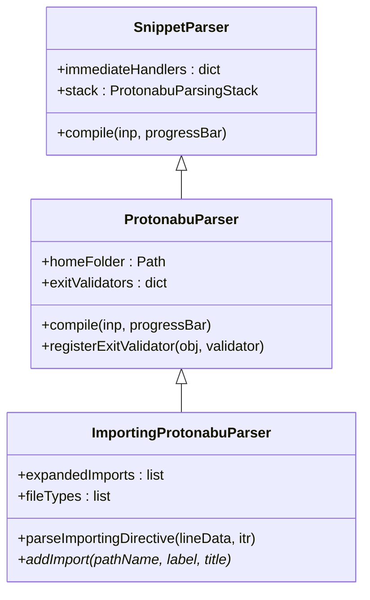

1.  **`BaseProtonabuParser`**: Provides the fundamental concrete tokenization, stack management, and dispatch routines. It parses fact structures strictly from a ready-to-use snippet stream (which may - or may not - be cached in memory, dependent on the stream) without file-system dependencies.
2.  **`ProtonabuParser`**: A concrete subclass of `BaseProtonabuParser`. It is the recommended target for general DSL parsers (such as the sample application's  `SiteParser` ). It adds exit validation, path resolution, and disk-compile hooks. 
3.  **`ImportingProtonabuParser`**: An abstract subclass of `ProtonabuParser`. It implements the importing infrastructure (such as resolution of `IMPORTING` directives and constructing the cascading pending snippet structure) and requires subclasses to implement the abstract `addImport` method to define how imported sources are integrated into the domain representation.

### 2.9.1. Non-Importing Parser Subclass Example

Below is a simplified example of `SiteParser` subclassing the concrete `ProtonabuParser`:

```python
from nabu.protonabu import ProtonabuParser, ProtonabuSchema, ProtonabuSnippetFromFile

class SiteParser(ProtonabuParser):
    def __init__(self):
        schema = ProtonabuSchema(ProtonabuSnippetFromFile(SCHEMA_PATH))
        super().__init__(schema, SCHEMA_PATH.parent)
        self.book = None

    def _initDispatch(self):
        dispatcher = ProtonabuParseDispatcher()
        dispatcher.loadHandlers(self.schema.labels, self)
        return dispatcher

    def parseBook(self, fact):
        self.book = Book(fact.getArgumentAsText())
```

---

### Chapter 3. Summary of the proposed way of work

#### 3.1. Overview

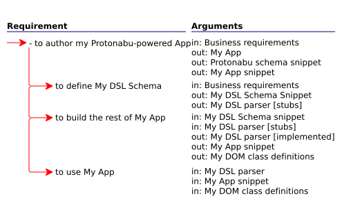
To author My (Protonabu-powered) application requires: 1) to define my DSL Schema, and then use it 2) to build the rest of My Application, and finally 3) to put My Application to good use, working with the DOM created from my Snippet by My DSL Parser.

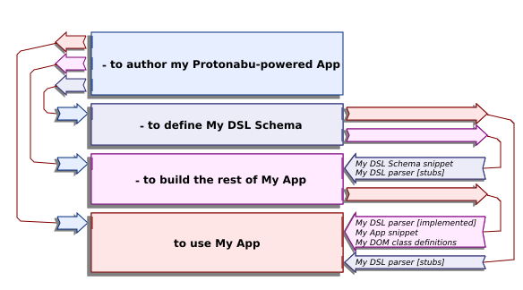
- The capability to define My DSL Schema feeds the capability to use My Application with "My DSL Parser" (in "stubs" state), and the capability to build the rest of My Application with "My DSL Schema snippet" and "My DSL Parser" (in "stubs" state). 
- The capability to build the rest of My Application feeds the capability to use My Application with "My DSL Parser" (in "Implemented" state), "My Application snippet", and "My DOM class definitions".

#### 3.2. Defining the schema

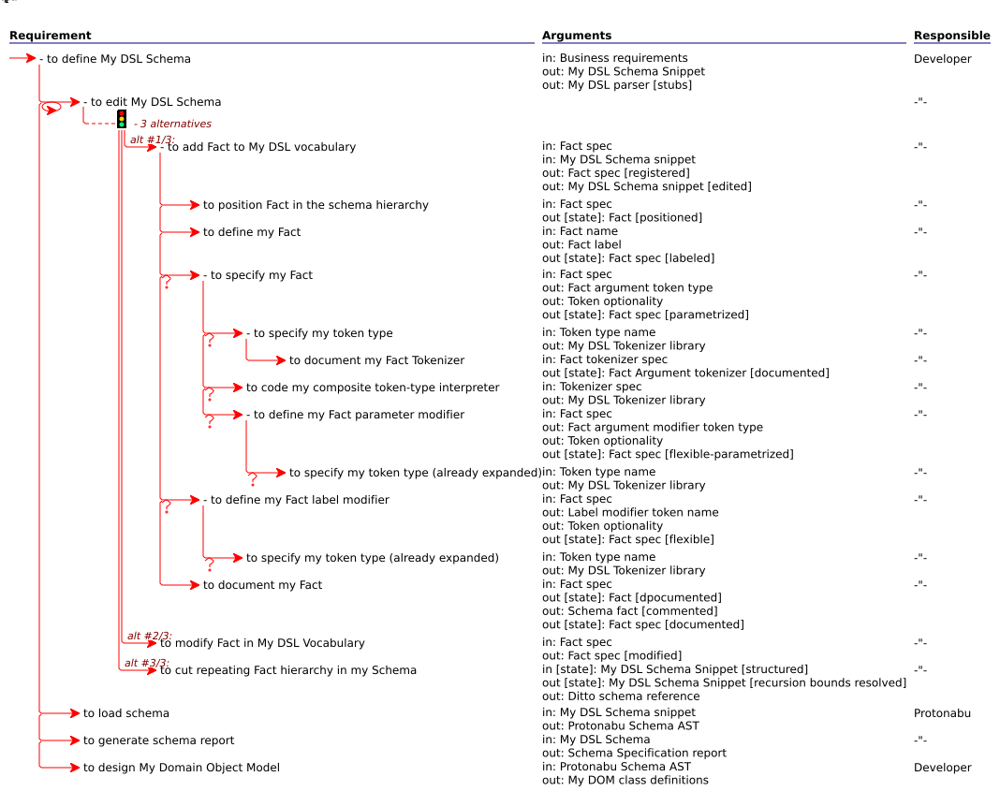
To define My DSL Schema requires: 1) to edit My DSL Schema (either by adding a Fact to My DSL vocabulary, modifying a Fact, or ditto-truncating repeating Fact hierarchy in my Schema), 2) to load the schema using the Protonabu engine, 3) to generate the schema specification report, and finally 4) to design My Domain Object Model (producing the DOM class definitions).

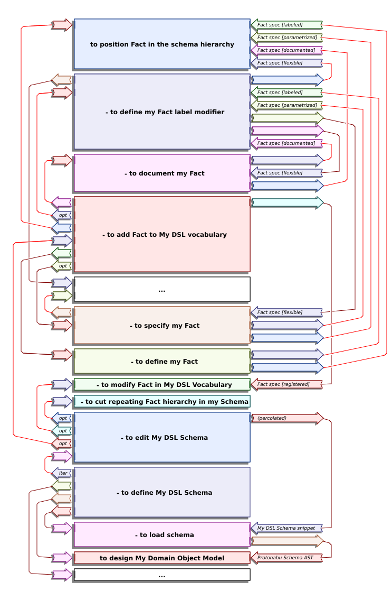
- The capability to edit My DSL Schema feeds the capability to load the schema with "My DSL Schema snippet".
- The capability to load the schema feeds the capability to design My Domain Object Model with "Protonabu Schema AST".
- At a granular level within the vocabulary definition:
  - The capability to position the Fact in the schema hierarchy and the capability to define the Fact label modifier feed the capability to specify the Fact with "Fact spec [flexible]".
  - The capability to specify the Fact and the capability to document the Fact feed the capability to define the Fact with "Fact spec [parametrized]" and "Fact spec [documented]".
  - The capability to define the Fact feeds the capability to add the Fact to My DSL vocabulary with "Fact spec [labeled]".

#### 3.3. Building the rest of the application

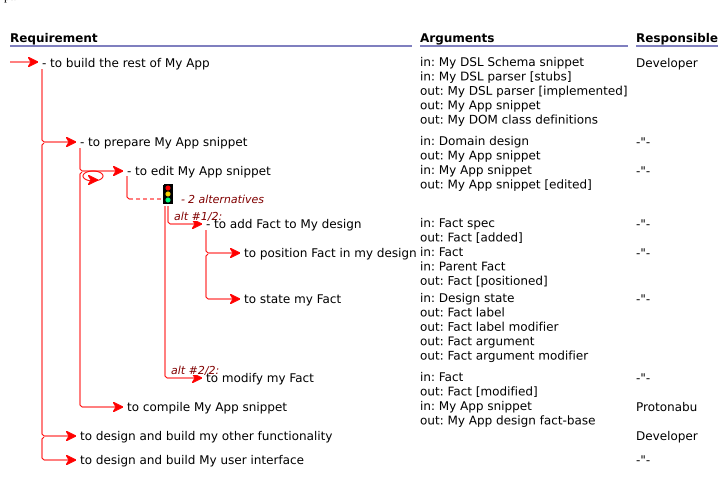
To build the rest of My Application requires: 1) to prepare My Application snippet based on the domain design, 2) to edit My Application snippet (either by adding a Fact to My design or modifying My Fact), 3) to compile My Application snippet (generating the compiled design fact-base), 4) to design and build other application-specific functionality, and finally 5) to design and build the user interface.

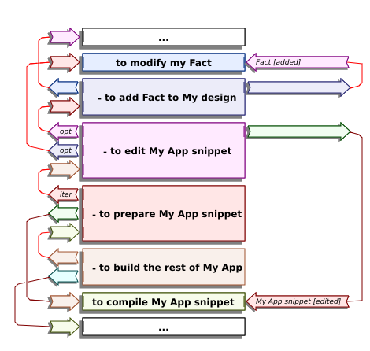
- The capability to prepare My Application snippet feeds the capability to edit My Application snippet.
- The capability to edit My Application snippet feeds the capability to compile My Application snippet with "My App snippet [edited]", producing the compiled design fact-base.

#### 3.4. Using the application

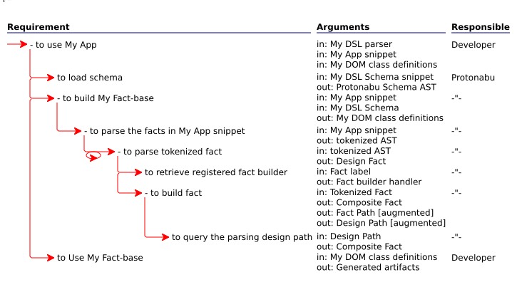
To use My Application requires: 1) to load the schema snippet, generating the Protonabu Schema AST, 2) to build My Fact-base (which parses the facts in the application snippet, parses tokenized facts, retrieves registered fact builders, constructs the facts, and queries the parsing design path), and finally 3) to put the fact-base to use (producing the generated artifacts).

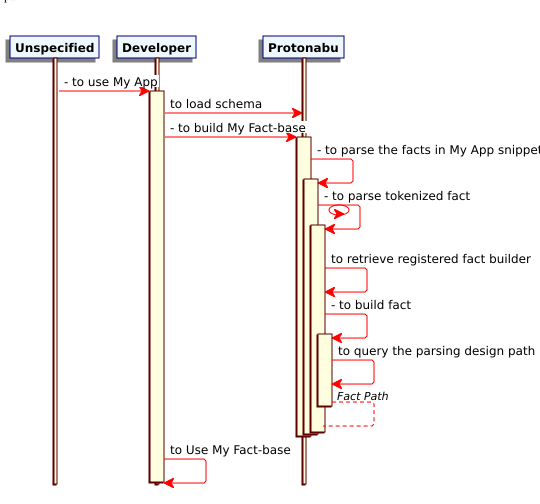
The majority of the work here is under responsibility of the Protonabu runtime. The user part is application specific.

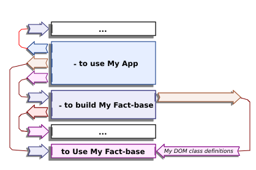
- The capability to build My Fact-base feeds the capability to Use My Fact-base with "My DOM class definitions".

## 4. The Fact-language  paradigm

### 4.1. About facts

A "Fact" is a sentence that is beyond debate. It is neither right nor wrong (which would violate the above by inviting debate). It is used, together with other facts, to build complex language constructs for a purpose. 

In the Nabu case, the purpose is to design and implement software products in response to business needs. In particular, we are after facts that 1) determine the *functionality* of the *product*, and 2) are also unambiguously *traceable* from the software back to the business. 

Software design is about ordering the functionality that is required of the product in a hierarchy of specializing detail, from business needs down to programmatic functionality, down to supportive implementation detail, down to implementation by the atomic facilities of the provided platform - an hierarchical-network structure.

The “fact” of the matter (that is beyond debate) is not in the design artifact itself, but in the latter being _essential_ to define the product. As in the case of capability. Remove this one capability and the product will not stand up to its title! For example: "to calculate time to target" is a _capability_ (of some RADAR product). "Our RADAR shall be capable to calculate time to target" is a _functional requirement_ (at the business end). "Time-to-target Calculator" is the name of a _part_ of the product. "Time-to-target Calculator API" is the name of a _package_ of the product. These are all design _artifacts_. But "our RADAR calculates time to target" is a _fact_! (For example, it may give our product an advantage over competitors that do not calculate time to target, or conversely, it may incur additional cost and reduced performance for functionality that some potential customers do not need). Any way, it is a *fact* that we cannot - and must not - ignore! (and if we do, we are found designing the wrong product). 

During design it is - for the sake of the narrative - more convenient to use the capability, functional requirement, part, package, module or other design artifact form, but with an eye open to the business *fact* that they are there to establish! And of course, there is no room in a proper design for self-serving programmatic contraptions that may not be traced back to the business; these, whatever they are (e.g., learning opportunities), are not *facts!* 

#### 4.2. Composite fact semantics

While some facts are just what meets the eye - a single sentence on a single line - many facts are *composite*, consisting, in addition to the *header* fact, of a hierarchy of so many *specific* facts, *indented* below. While each indented fact may still be be interpreted "on its own" (by those who are familiar with the context), it somehow contributes to the fact above, by “specifying” it (from “specific” - to fill with detail). Consequently, a fact snippet is seldom left-justified like ordinary text, but tends to be a jugged structure of lines that are indented to various degrees. The degree of indent *ranks* the facts hierarchically. Facts ranked one (not indented) specify the subject of the very fact base (which is not disclosed - there is *no rank zero*). A ranked fact (indented to some degree) specifies the header fact *above* it (precisely: it specifies the closest rank-minus-one fact above). 

Interpreting a fact snippet requires the following two capabilities: 1) to tokenize composite fact(s) giving an Abstract Syntax Tree (AST), and (2) to interpret the tokenized facts (said Abstract Syntax Tree) giving a fact-base (also called DOM - Domain Object Model). Protonabu segregates the two functions into distinct mechanisms, where the parsing function is generic and feeds the client language engine through an opaque interface. For the Protonabu parser architecture - see Chapter 1. For now, we can restrict this discussion conveniently to the parsing function.

Given the composite fact “A (B, C)”, featuring fact A ranked *one*, and facts B and C ranked *two* below it, and regardless of the particular fact-language in which this is expressed, one may safely conclude that facts B and C *specify* fact A. But in order to tell whether this assertion is true or false (in the respective problem domain) - and whatever *to specify* means in the context of facts A and B and facts A and C respectively, (and whether C specifies A in the same meaning that B specifies A) - we need a language interpreter that is fed by the fact tokenizer and *understands* the semantics of facts and fact ranking in its universe of discourse. (For example, "Nabu").

*Example of an unstructured composite fact snippet (where the facts themselves are unlabeled half-sentences in the "capability" format), specifying the significant capabilities required in order to develop software:*

```text
to develop software // [1]
    to define the requirements // [2]
        to understand need(s) // [3]
        to model the problem domain // [4]
    to design the solution // [5]
        to select architecture(s)
            to make design decision(s)
        to model the solution domain
            to apply design pattern(s)
        to confirm traceability
    to implement the solution
        to code the solution
        to test the solution
        to package the solution
```

*Notes:*

1. Fact ranked 1.
2. Fact ranked 2 (child of "to develop software").
3. Fact ranked 3 (child of "to develop software / to define the requirements").
4. Another fact ranked 3 (child of "to develop software / to define the requirements", sibling of "to develop software / to define the requirements / to understand need(s)").
5. Another fact ranked 2 (child of "to develop software", sibling of "to develop software / to define the requirements").

Apparently, *the entire* fact hierarchy is dedicated to specifying the one capability "to develop software". (Because it is the only fact ranked one). 

By just learning this fact base as stated, and without knowing the first thing about "developing software" (but given fluency in the English language), we can still salvage a wealth of information from the syntactical structure of the indented text. For example:

- You cannot claim to have successfully "developed software", unless you have found the time "to define the requirements" (and can hopefully demonstrate this claim with some tangible products, as per your method), as well as two other capabilities - "to design the solution" and "to implement the solution". I am justified in asking you "did you implement the solution?", and am equally justified in refusing your work if I do I not get a convincing answer.
- If you have successfully "defined the requirements", then you have just made one step towards the completion of "to develop software". (Assuming you are indulged the process of one).

- In order "to develop software", one must summon (e.g.,) the capability "to define the requirements" (whatever that may be). For example, if we must interview an applicant for the job of “software developer”, we may inquire for qualification for - and experience with - “defining requirements”, even if *we* cannot tell what that is, really! (The applicant should).
- The capability "to understand needs" is only useful and worthwhile in the context of "to define the requirements". (Because it is not cited below any other fact). For all we know, one can “design a solution” successfully, without defining a single need (but assuming the output of the latter as precondition - more on this later).
- There is very likely a transform of "Needs" to "Requirements" (with specifics TBD).
- "Design Patterns" and "Architectures" are part of the solution and do not apply to the problem.

And so forth. Any rationalization may do to clarify and assess the fact-base (in the lack of a formal account provided by the author), as long as supported by the bare composite-fact syntax. And if we happen to proceed to carry the fact-base to conclusions that are unlikely or unwanted in the problem domain behind it, while adhering to the facts as stated and as organized, then we are justified in criticizing the validity and usefulness of the fact-base (regardless of whether some of the facts are - are not - "correct" in the problem domain).

Recursive syntactical language, in general, empowers the listener with the capability to establish facts that may be communicated and put to good use by parsing the immediately manifest form, in parallel with - and even regardless of - content. The inflection point is that the listener is no longer required to be familiar with the subject matter in order to make these observations, and - if the speakers knows what they are talking about and mind their syntax - it will work most of the time. Whether this is right or wrong - and how we have come this way - is beyond the present scope. This discussion is about the technique and uses of constructing and parsing the form, paying respect to - yet ignoring - the content, except in the role of examples.

This does not come to belittle the content. Even if (assuming form to be) originally introduced as parasite, starting with content inviting form, at some point, the parasite equals its host and at some further point (in the non-biological paradigm - rather than choking both to death) it surpasses it, ending with a positive-feedback loop of form inviting content, as demonstrated clearly above. Technological progress has largely been about form (e.g., technology) accumulating over and eventually overtaking content (e.g., usage). We build machines to improve manual use cases, only to end up fulfilling novel use cases that would not be possible without the machines behind them. And we may eventually end up with further uses cases whose only function is to please the machines. The current advent of next-token prediction technology ("AI") is as good an example as any!

#### 4.2.1. The archetypal EBNF

This “hierarchy of facts” is inspired by EBNF (“Extended Bakus/Naur Form”) - a common notation for specifying the syntax of programming languages.

_For example, here is a graphic EBNF visualization of the fact hierarchy above (rendered with PlantUml):_
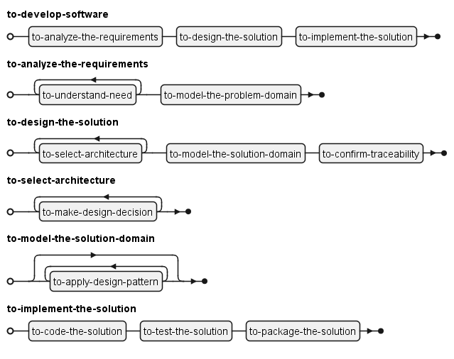

Note that the task of visualizing the fact hierarchy in the EBNF medium has made me struggle with the (in my opinion - premature) conditions that there must be at least one need, at least one architecture, and at least one design decision, but there may be zero design patterns applied. Whether this anecdotal knowledge adds anything crucial in this early iteration is to be debated. But the fact that I could do without this analytic information in one visual medium (but could not do without it in another) indicates that the medium used to _visualize_ the composite fact happens to also be a contributor to its (presented) content and may not be ignored! (And that the very "indented text" format read by Protonabu is not really a "generic" form - because there is no such thing - but a convenient "generic" visualization). This unavoidable fact is used to facilitate the “Creative Multi-visual Design” paradigm of the Nabu way of work, discussed separately.

#### 4.2.2. “To specify fact” requires"to specify fact"

The capability to author a composite fact may be conveniently separated to two functional strata, as specified in the following composite capability:

```text
to need fact
    to specify the fact
        to condition the fact
        to order the fact
        to need fact(s)
```

*Explanation:* There is this fact that we may have use for. Coming down to specify the fact in detail, consider that it may be *constrained* by conditions (for example, the sub-fact does not always take part in establishing the header fact). A well as by horizontal order. It may somehow precondition - and be preconditioned by - other facts (for example., consume what they produce), and therefore must follow them. And then, the fact may be further *specified*. Consider that there may be some other facts that may be needed to assess and establish said fact. (This is implied by the transitive recursive specification of “to need fact” under "to need fact").

### 4.3. The fundamental hierarchy of need

Facts may be of various "fact types", falling into application-dependent categories. Apparently, a well-formed composite fact is monotonous, sticking to one fact type, thus featuring “an hierarchy of &lt;fact type&gt;”. (The words "hierarchy" and "composite" are synonymous when it comes to "fact", where the first emphasizes usage and the latter emphasizes structure). Nabu specializes in three (parallel) composite fact types: 1) the Requirement hierarchy (functionality), 2) the Product and Part hierarchy (structure), and 3) the Need hierarchy (semantics), in this order of importance. Surprisingly, the need hierarchy is last on this list because Nabu aims at designing the actual product, (and only then) demonstrating fidelity to the business needs. It would take a special business-analysis fact-language to prioritize the needs (and this is not addressed here).

*The difference between "need" and "requirement":* A need is a fact stated by - or on behalf of - the business side, which must be fulfilled (on the solution side) by the product. A requirement is a binary-directed association between two capabilities ("requiring" and "required") that contributes to product usage (as evident from its structure), in response to a need. The crucial point that makes the difference is that the designer is concerned with crafting parts that fit well into a working product, and must be constantly reminded that the product - as well as any of its parts - are there to serve the business. The product is serving a major business objective, and each of its parts (as well as the facts of their connection and the facts of their motion) is there to serve a discrete business objective. In particular, in the "object-oriented" paradigm of programming (kind of problem solving), the "solution domain" model is an extended (but never ambiguously warped or distorted) projection of the "problem domain" model.

A design is *demonstrated* by a *composite need*: an *inventory* *list* of all it *may take* to achieve some goal (i.e., to establish the rank-1 fact), cascading. While you are unlikely to be able to manufacture a working product from a bare composite need (because it lacks the practical bonding machinery), we may use it to assess the relevance and completeness of the design, answering the question: “is this indeed _all_ it takes?”, as well as abort a misinformed design before it runs out of hand - “this proposed contraption, whatever it is, cannot provide what *we need!*”. In a top-down design, once the composite need is accepted, practical requirement constraints (such as conditions for actually requiring each of these facts, if at all, the final horizontal ordering of the facts and additional "minor" facts required to facilitate the working product and attach it to the platform) may be imposed on the composite need, giving composite requirement. And this already requires specialized syntax. Conversely, in a bottom up design, the composite need be may be reverse-engineered from the actual working composite requirement (removing the bonding design machinery). The vertical order of the design *process* - top-down or bottom-up - depends upon the problem and solution domains, and is very likely to alternate between both ways. Consequently, attempting to dictate it by brute force (e.g., top-down, as in the "Waterfall Model") has never done anyone any good.

Composite requirements implement composite needs, but not necessarily one-to-one. 1) The association may - and very likely will - be one-to-many (i.e., rigorously *specified*), and 2) it may rearrange the hierarchy to a (still reversible) extent, as the result of applying architecture, design patterns, common implementation idioms, and platform constraints, in this order, provided we have a back-mapping for these patterns. (The case of many-to-many typically indicates insufficient business analysis. And the special case of many-to-one is typically reserved to infrastructure that has been abstracted from any specific business context, creating its own generic business context). 

*For example, the following Nabu design snippet sketches an implementation of the first arm of our sample use case:*

```text
PRODUCT Software Development Guidelines
    PART: Client Liaison
    	CAPABILITY: to understand the needs
        CAPABILITY: to TRAVERSE the needs
    PART: Analyst
    	CAPABILITY: to model the problem domain
        CAPABILITY: to make requirements out of needs
        CAPABILITY: to process need
    USE CASE: to develop software ...
        REQUIRES: to define the requirements 
            REQUIRES: to understand the needs 
                NONBLOCKING // [1]
            REQUIRES: to model the problem domain 
                REQUIRES to make requirements out of needs 
                    REQUIRES to process need 
                        SCANNING [GIVING "Current need"]: to TRAVERSE the needs // [2]
                        GIVING: "Candidate requirement" ... // [3]
                    REQUIRES: to invalidate need collection ...
                        BLOCKED BY: to understand the needs // [4]
        // ...
```

*Notes*

1. "to define the requirements" begins with launching the Client Liaison's capability "to understand the needs" in the background.
2. The Analyst proceeds to iterate on pulling needs from the Client Liaison in the background and processing them to requirements. The exact mechanism for obtaining the needs one at a time ("to TRAVERSE the needs") is yet to be defined.
3. The exact procedure for transforming need to requirement (which is very likely to be many-to-many) is yet to be defined.
4. Once the Analyst is satisfied with the requirement definition product, she signals Client Liaison to terminate and waits for its approval.

*This "Requirement Ladder" Nabu visualization emphasizes the parallelism of the design:*

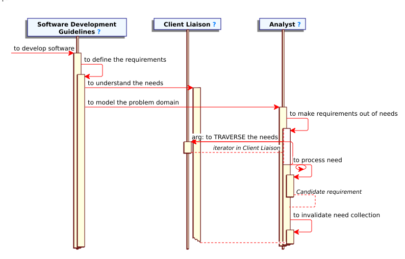

#### 4.3.1. Products, their parts and their capabilities

##### 4.3.1.1. Typed fact hierarchies

The “software” example above illustrates an hierarchy of _capabilities_, indicated by the English _gerund/predicate_ form: “to &lt;verb&gt; &lt;object&gt;”, where the object often contains a - tangible or non-tangible - noun, typically the very part or product that the capability supports. (This works seamlessly in English and e.g., Hebrew, but some languages do not lend easily to this mechanical treatment). Typical examples are (1) manpower - specifying the graph of skills required of the members in a team (we need this designated team-member to do this and that for us, drawing upon the capability of her peer - that we also must hire - to this and that for her, and so forth), and (2) procedural programming - specifying the (call tree of) the required programmatic functions. 

*Now, let us consider a parallel hierarchy of products:*

```text
Software
    Requirement Analysis
        Need(s)
        Need Analysis Specification
    Design
        Architecture(s)
            Design Decision(s)
        The Solution Domain
            Design Pattern(s) Applied
        Traceability Report
    Implementation
        Code Base
        Test suite
        Packaging
```

Note that substituting capabilities by their respective products has left the hierarchy intact. Also note that this has not been an entirely mechanical transliteration job. Some names have been adjusted to be be make sense in the changed perspective!

Actually, for the present subject, I prefer the original raw “composite need” form, because it does a fair job of introducing the problem domain, without premature plunging into detail (which is the inevitable punishment of calling products and parts by name - there may always be more than alternative, and selecting one is a marriage contract with a specific implementation). On the contrary, this “composite product” form is premature and leaves something to be desired. *And for a reason!*

A professional design process requires a clear vision of the functionality to be delivered by the final product  to be - the product’s “definitive capabilities” - at a very early stage of the project, and then adhering to this vision all along the way. We provide a product that - e.g., at the push of a button, the release of a lever, opening a gate, etc. - will do this and that. We have little use for a fancy box full of smoke and mirrors that just sits in the corner and does nothing besides looking technological. On the contrary, naming the products that it would take to assemble this mechanism and their exact breakdown to the *parts* - e.g., sprockets, levers, relays and cogs  - that will eventually be blessed with these capabilities (and identifying these products and their parts to begin with) may take many iterations and is highly implementation dependent.

For example, faced with the task "to design a vehicle", we may observe right at the start that “our vehicle is going to need a steering wheel” (among other things). And at least because our brother in law makes these, and his company can offer us a good price. But this is hardly the kind of fact that defines a product! It will be more productive to establish the _definitive_ facts, that we must need the capability “to steer the vehicle” (it turns out that it may not always progress in a straight line or at random), and that this must be handled from inside the vehicle, and is very likely to be assigned to a specialist person, A.K.A “driver” (or “pilot”, as applies), rather than to any random passenger or divine providence. The “Steering Wheel” technology is common enough and may - or may not - be the obvious choice. But it is not the only technology available for the job; some vehicles, such as bicycles and tanks, have been employing other steering technologies successfully for years. And finally, not all vehicles are steered from the inside. Trains, for example, are steered from the outside (this capability is delegated to the tracks along which the train is progressing).

A product shall be designed 1) to satisfy functional requirements (as understood from - explicit or implicit - business needs), and only then 2) to consist of a mechanical structure that may be assembled within the available technology. And in this order. When requirements for extension of the product arrive - and they will - we must be ready to let additional aspects of the problem domain return home and extend the technological structure, even if the latter was not explicitly designed to support them! We may - or may not - make it, if the solution model is a - restricted but still true - replica of the problem model, hopefully, supplying hooks for extension. But we will not make it, if the product was originally designed to _inhibit_ extension (usually, because such implementation machinery was more _efficient_ - at the time)!

A frequent design fallacy is to cannibalize finished parts from some existing *solutions* at random and somehow jury-rig them into a solution (characteristic of "vibe coding" and “end-user computing”), rather than assess clearly what the *problem* is to begin with (and let the solution unfold, with - or without - consulting existing similar solutions). In a professional design, the hierarchy of capabilities must be prioritized over the hierarchy of products and parts - both in timing (of the development process) and structurally! (A.K.A the "functional paradigm” of programming).

##### 4.3.1.2. Labeled fact hierarchies

Here is a composite _labeled fact_ that combines both prospective fact hierarcies, in the form of “&lt;product or part&gt;: &lt;capability&gt;”. (The all-caps prefix preceding the colon is the “label”).

```text
SOFTWARE PRODUCT: "to develop Software"
    REQUIREMENT ANALYSIS: "to analyze the Requirements"
        NEED(S): "to understand Need(s)"
        NEED-ANALYSIS SPECIFICATION: "to model The Problem Domain"
    DESIGN: "to design the solution"
        ARCHITECTURE(S): "to select Architecture(s)"
            DESIGN DECISION(S): "to make Design Decision(s)"
        THE SOLUTION DOMAIN: "to model The Solution Domain"
            DESIGN PATTERN(S) APPLIED: "to apply Design Pattern(s)"
        FUNCTIONALITY TABLE: "to confirm Traceability"
    IMPLEMENTATION: "to implement the solution"
        CODE BASE: "to code the solution"
        TEST SUITE: "to test the solution"
        PACKAGING: "to package the solution"
```

*Read:* "We need to build (or purchase) these products and their parts that are blessed with these capabilities, which are going to be used by us (or among themselves), and in this order of importance". In this example, we happen to need some ”software” - that is, we wish to invest in someone’s capability to develop "Software Products" (i.e., “to develop software”) - and this in turn draws upon that person's (or subordinates') restricted capabilities for "Requirement Analysis" (i.e., “to analyze the Requirements”), and so forth.

*(For the sake of readability, and to emphasize that this formula only emulates free-form text (but is not, really), the labels in this example are all-capitalized, the capabilities are quoted, the verb part of the capabilities is italicized, and familiar products and their parts used in capabilities are capitalized).*

Apparently, the labeled hierarchy of products and their capabilities, which I have improvised for the purpose of this discussion, is not mature at this early iteration. In general, basing the design on composite products is risky at the conception stage, because it leads to premature decisions that had rather be deferred to elaboration and implementation. While referring to products and parts that are native to the problem domain is unavoidable even at the conception phase, they must be considered as temporary placeholders, serving to prevent clutter by classifying capabilities ad hoc. (it is more convenient - and manageable - to control 10 parts, concentrating 10 capabilities each, than 100 random capabilities). Which is acceptable, as long as we are prepared mentally to move the capabilities freely among the candidate products and parts and introduce and discard the latter, as needed to facilitate the aggregation. People who are not trained in this sort of analysis may find it hard to follow (because the natural human tendency is to associate capabilities with parts and products permanently). 

##### 4.3.1.2.1. The magic of the labeled fact

A composite labeled - as opposed to unlabeled - fact it is _creative_ (A.K.A. “generative”). It arouses one’s curiosity! While the audience of a single-typed composite fact may be content with the narrative as stated, ignoring obvious defects, this is seldom the case with a labeled composite fact! For some reason, it has the magic of prompting one to either 1) plunge inside and fix it, or 2) turn a deaf ear and leave it to "professionals"). And that includes - in the example above - going back and forth between the primitive interlaced capability and product hierarchies. 

I have not investigated the exact reason. Apparently, it is the *counterpoint* - the combination of two narratives unfolding in parallel - that does the trick! For some reason, we tend to take a sequential uninterrupted narrative for granted (glossing over its defects). We typically wait for the whole narrative to unfold and then attempt to digest it in one piece, which seldom works. And this makes it (the sequential uninterrupted narrative) analytically useless. In contrast, our faculty for criticism finally kicks in, when we are forced to make peace between two narratives that insist on unfolding in parallel. 

This is very likely for the same reason that we find polyphonic music more appealing than a monotonous melody that is played over one instrument with no variation and no overtones. If you wish to con your audience, be sure to recite your facts in a single uninterrupted narrative. If you want your audience's cooperation (and considering yourself as "audience" for that matter), you had rather distribute your facts among so many (intercepting and intersecting) narratives and find a smart way (following their dependencies) to unfold them in parallel. 

The "labeled fact language" paradigm does just that, and it has been doing a honest job for me, over many years.

##### 4.3.1.3. Syntactically-labeled facts

The Nabu design language labels its facts in a subtler way. Each and every fact is labeled by its *syntactical role*. We do not just state the fact, we precede it by announcing who is at the door. And then the operational hierarchies - requirement, product/part and need, to name a few - are *visualized* automatically from predefined *label* - i.e., role - semantics. Not so complicated formulas embedded in the visualization engine.

The label is mandatory! Even when it could easily be inferred from the format of the fact or its hierarchical position. *And for a reason!*

For example, this "USE CASE" composite fact ("use case" - single entry-point procedure that suggests how the product was originally meant to be used), consists of a "TITLE" and then mostly of "REQUIRES" sub-facts. The latter cite "CAPABILITY" facts that - unless indicated by a special "structural completion" syntax - must have already been specified above. (For the sake of the illustration, let as assume that these (self descriptive) definitions exist separately).

```text
    USE CASE: to use My App
        TITLE: Using My App
        REQUIRES: to load schema 
        REQUIRES: to build My Fact-base
            REQUIRES: to parse the facts in My App snippet
                REQUIRES: to parse tokenized fact
                    SCANNING: "Abstract Syntax tree"
                    REQUIRES: to build fact
                    	FROM: to retrieve registered fact builder
                        USING: "Tokenized fact"
                        GIVING: "Composite fact"
                        REQUIRES: to query the parsing design path
        REQUIRES: to Use My Fact-base
```

Now, if we were to remove the "TITLE" and "REQUIRES" labels from the facts under "USE CASE", as in the example below, the Nabu parser could be trivially extended to infer their types (i.e., their missing labels). For example, the quoted free-form text, immediately following the header, is the title. And the requirements are easy to recognize: Nabu identifies every fact that starts with "to", followed by a strong verb and object, as a "Capability". And a capability that is cited in the context of a use case always means "Requirement" (of the capability, by a capability).

```text
    USE CASE: to use My App
        "Using My App"
        to load schema
        to build My Fact-base
            to parse the facts in My App snippet
                to parse tokenized fact
                    SCANNING: "Abstract Syntax tree"
                    to build fact
                    	FROM: to retrieve registered fact builder
                        USING: "Tokenized Fact"
                        GIVING: "Composite Fact"
                        to query the parsing design path
        to Use My Fact-base
```

Indeed, at an early stage of the Nabu project, I was toying with the above "selective labeled" form, and eventually decided against it, because it created more problems than it solved. (For example: the title may appear anywhere at rank-2, not only at the start. And then, why not get rid of the "USING" and "GIVING" labels, as well? But then, how can you tell who is whom by just looking at them, without additional syntax? etc.). It so turns out that "saving" the extra effort of typing the label is not worth the resulting ambiguity. And even that little effort may be eliminated, embracing the ambiguity, by a smart editor that can do label "auto-completion", or by simple selection from a context-aware drop-down menu. (And it so turns out that the number of labels to choose from, once past the entry-point, is negligible).

The bottom line is that syntax is neither nuisance nor luxury that one must waste time and effort to work around. It is the primitive communication protocol that makes expressing your ideas easy and predictable and, by that, frees your intellectual capacity to tackle the real issues. 

##### 4.3.1.4. Hierarchies are permanent. The order of building them is not

A realistic design process consists of alternating bottom-up and top-down phases. 1) Naming complex structures that aggregate out of primitive facts, and 2) inferring (unknown or just overlooked) primitive facts from the syntactic structures of given (should-be composite) facts. And in any order and combination. And as much as needed.  (which, alas, is incomplete - or even non-available -  as yet)

On the contrary, a design process that is artificially forced to proceed in one direction (e.g., top down) is naive and non-realistic! We may expect a healthy design process to commence with throwing in capabilities (because this is what we are going to sell, eventually), which may either materialize out of thin air or get cannibalized from existing designs - it does not really matter. Gradually, products and their parts and their sub-assemblies suggest themselves and are evaluated against the pool of capabilities. Once the design becomes stable enough to suggest a labeled composite fact that prevails, we may call learning off, and relax into significant design iterations that the client and potential users may relate to and approve. (Most clients cannot survive in a world where capabilities replace owners on a hourly basis).

Of course, products and parts are not devoid of analytic value. (And the client will typically commence by naming candidate parts and products, drawing on the only implementation technology they happen to be familiar with). For example, the fact that your design seems to lack a part that is visibly common in competing products shall make you ponder whether you have missed its designated capability. (E.g., the fact that your vehicle design is missing anythinig that even remotely resembles a steering wheel *may* suggest that you have missed the requirement to steer the vehicle - if there is such. Or that you may indeed be steering your vehicle, but you have just invented a novel steering technology, to be patented). And then, the fact that you find it hard to *name* the product or part that should be responsible for an obviously-required capability - a frequent and healthy design challenge - may indicate that you either 1) have indeed just invented a capability the like of which has never been heard of (requiring a novel taxonomy), or 2) that you have simply misunderstood the business needs. 

Finally, at some iteration, the resulting labeled composite will (hopefully) become stable enough (i.e., hardly given to change anymore) to be implementable given the available technology. (It is not required to be perfect. And it will never require inventing a new technology - that would take a separate project).

#### 4.3.2. The fundamental properties of composite requirement

The following properties of the "composite-requirement" type of fact are crucial for the purpose of design: (1) Iteration, (2) Recursion, (3) Reentrancy, (4) Collapsing, (5) Coupling, (6) Functional Escape, and (7) Conditioning.

##### 4.3.2.1. Iteration

A fact of need may be _iterative_ - involving either multiple instances of the *resource* to consume/produce or repetition (of the *process* for establishing the fact). The two use cases invite the same solution but come to solve different problems. 

*It is the very fact of iteration that makes composite needs possible!*

If we know that a fact is *required* (needs to be fulfilled) 50 times in a row, then - provided that fulfilling each of the 50 iterations requires applying exactly the same skill using the same machinery - we can specify the fact of the capability once, and annotate it with the _condition_ that it must be repeated 50 times. If this fundamental design decision was not possible, than composites that contain facts with large - or varying - number of iterations - *which is the common case* - could not be expressed, and there would be no automation! (We would be condemned to repeat the operation fifty times in a row whenever needed, over and again, blindly, without realizing that we are repeating ourselves). 

In addition, iteration has other crucial technological roles, such as creating the illusion of stability (e.g., using rotary motion). In fact, it is hard to imagine a single *technological* solution that does not involve iteration!

In the examples above, I have conveniently indicated the fact of iteration in the plural form, within brackets. The brackets indicate that 1) the quantity is not part of the fact; it is part of its *requirement* - the context in which it participates - and the symbol is stuck inside it due to the constraints of the visualizing medium, as means of "inflection", and 2) the fact - by virtue of the quantity - is also *optional*. (In the programmatic interpretation of “many”, zero and one iterations are also acceptable, by default). 

And then, when one gets down to a particular fact language, one is likely to add the exact _conditions_ of the iteration (e.g., the guard for breaking the loop, where to obtain the population to scan, or the numerical range to monitor). But to begin with, it is the very fact of iteration that makes a huge engineering difference, e.g., by introducing "moving parts". We may expect the design of a product that is defined by just the facts A, B, and C to present a simpler engineering challenge than the design of a product that is defined by facts A, B, and so many C’s, or a product that is defined by facts A, B, and so many visits to fact C.

The (dubious) convention of pluralizing the needs within brackets was grabbed here ad-hoc to compensate for the limitations of the textual visualization medium. On the contrary, the following Nabu “Pseudocode” visualization comes with a built-in graphic notation for depicting iteration on *requirement* level (the red connecting arrow, the "edge" in the graph), so inflecting the text (the target of the arrow, the "node" in the graph) is not necessary,


*And the same goes here:*

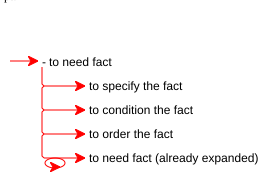

*(The "already expanded" comment is there to prevent infinite recursion loop).*

The need for iteration increases the *complexity* of the resulting product with “moving parts”, suggesting, for example, that it will consume more energy, take longer to design and manufacture and will require more rigorous testing. In software, iteration may require additional screen real estate, and the decision where to pause (the iterative display), which incurs additional iteration and additional complexity. And same goes for the communication buffer used to convey this information (that will have to be more rigorously parsed and may overflow), and so forth.

In the "Software Development" example, the requirements “to understand need”, “to select architecture”, “to make design decision”, and “to apply design pattern” are iterative. However “to define the requirements” is discrete, although there are likely to be multiple _requirements_. (The plural form of “requirements” in the capability name is an innocent part of the name, rather than of a requirement from it). The reason is that this fact allegedly covers the processing of all available requirements _in bulk,_ possibly stamped. Here, the iterative alternative - “to define requirement(s)” - would erroneously suggest multiple “model(s) of the problem domain” (one per requirement)! 

On the contrary, there is apparently nothing that binds or restricts the various efforts “to understand need”. You can pick as many needs as you can find, and in any order, just put them there!

##### 4.3.2.2. Recursion

(The term “recursion” is used here in its _programmatic_ meaning). 

A composite fact of need (at least) may be _recursive_ - requiring (among other things) another instance of its fulfillment. (Stating that it requires “itself” is vulgar language, mistaking instance for entity). For example, in the composite fact above, the main instance of “to need fact” may involve a minor instance of “to need fact” - giving the familiar “composite need” cascading structure. This is better understood, when the required capabilities are inflected, to suggest requirement conditions: “to need (one) fact” may involve “to (further) need (other) fact(s)”.  For another example “to break (one) requirement to so many (sub-)requirement(s)” may further involve “to break (each of these sub-)requirement(s) to so many (further sub-)requirements”, and so forth. “To render shape” may involve  “to render (so many sub-)shape(s)”. A system is made of so many nodes, where each may be either a leaf or a (sub-)system in its own right. Etc.

Although recursion resembles iteration (both invite multiple instances or visits), it follows naturally from the *composite fact* structure (plus the non-trivial overhead of nested state management, that we tend to take for granted), whereas iteration must be injected from the outside, as explicit condition - an adornment. This latter observation (that recursion is easier to express than iteration in a composite-fact language) has led some programming-language authors to demonstrate that any iterative requirement may be emulated by recursion (and voila, we can remove iteration from the lexicon). However, this self-serving implementation-dependent optimization does not agree with business requirements, where iteration and recursion suggest completely different semantics! (And not everything that is possible is also desirable).

*For example, this simple iterative workflow does a honest job of specifying the problem, and is thus (hopefully) extensible:*

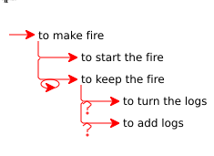

*Read: to make fire requires to start the fire and then to embark on to keep the fire as much as it takes, which requires (in each iteration) to optionally turn the logs and to optionally add logs. (However, "to extinguish the fire" is not included in "to make fire". iWe expect the fire to die naturally when not tended anymore, and to be safely contained in an isolated furnace).*

*But then, the following forced-recursive version is a self-serving artifact that distorts the problem and (though, admittedly, functional and still reverse-engineer-able), it is left to be seen whether it may be extended without being broken:*

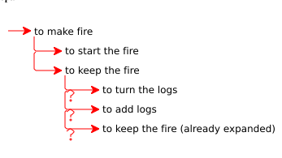

*Read: to make fire requires to start the fire and then to keep the fire (once and unconditionally, for all we know), which requires to optionally turn the logs, to optionally add logs, and to optionally - of all things - keep the fire(!?)* 

The unsophisticated (first) procedural solution is a direct replica of the problem. On the contrary, in this problem domain, "to keep the fire" does not *require* "to keep the fire"! Whereas, in another problem domain, "to fulfill composite need" does *require* optionally "to fulfill composite need". "To make fire" and "to fulfill composite need" invite different engineering solutions (iteration and recursion respectively) because they portray different problems.

The core error in the recursive alternative solution is in misidentifying the business need, and the price of employing it in the solution. Contrary to the vulgar interpretation, recursion does not involve twice (or more) of "the same" requirement (e.g., programmatic function). This is self-canceling. It involves multiple requirement *fulfillments* (e.g., programmatic function *calls*), each managing a distinct state (e.g., programmatic parameters and resumption address, in address-based computation), as well as the capability to navigate among these state instances. Take for example, the composite fact to solve (the main) problem, which  requires to solve (a minor) problem, and so forth. The solution must manage two instances (or more) of the fulfillment of "to solve problem", each keeping its own state (main and minor, respectively), as well as the capability to unwind and "return" from "minor" to "major" states, if necessary. (Whether the latter "recursion tail" may - or may not - be optimized-out is, in my opinion, implementation trivia). 

While "to solve the (main) problem" requires "to solve (a minor) problem)" and the concurrent management of two states, as dictated by the problem (given the recursive solution paradigm), on the contrary, "to keep the fire (current fulfillment)" does not not invite creating "to keep the fire (next fulfillment)" to temporarily replace it! And what state will the latter hold? Remembering the state at which the logs were left will become useless in half an hour. Counting the logs that have already been used is not very useful either - just looking out of the window at the stack of logs remaining outside should be enough. And it is well possible to skip feeding the fire, recalling that it was left in a good condition, just to come in the next iteration and find it dead. Keeping the fire is an ongoing concern, which - for all we know - is stateless. In each iteration, the state - and very existence - of the logs being burnt is evaluated from scratch, which may as well be performed by someone who has just entered the cabin, and was not there when the fire started. There is no execution history to log and no pending stack to manage. 

*Loss-less reconstruction:* The reason why is this apparently subtle programmatic distinction is so important. Nabu was built from the ground up to support *round-trip* engineering, which means that 1) all business needs must be unambiguously represented in the code as requirements (e.g., function calls, nested code blocks), and 2) all requirement artifacts (e.g., function calls, nested code blocks) must map back unambiguously to business needs (subject to the recognizable application of design patterns and idioms, e.g. "dependency injection", The "Visitor" Pattern, The "Composite" Pattern, and exploitation of recursion to emulate iteration). The solution must ensure *loss-less reconstruction* of the problem. Consequently, we can take 1) iterative implementation for iterative problem (e.g., stateless repetition) and 2) a recursive implementation for recursive problem (e.g., navigating a tree structure). In the round-trip paradigm, using a recursive solution to implement an iterative problem and vice-versa - using an iterative solution to implement recursive problem -  is dubious design. 

The only justification for, e.g., using recursion to emulate iteration, is a technical restriction, imposed by the platform. And this already falls in the category of "design-patterns applied", which must be accompanied by massive documentation, to guarantee loss-less reconstruction. Without a precise and up-to-date in-code documentation, which is a liability, we may land in the wrong problem domain, i.e., find ourselves servicing the wrong product!

##### 4.3.2.3. Reentrancy

For some reason, we tend to analyze functional requirements under the tacit optimistic - alas, often unjustified - assumption that a capability that is specified by lesser capabilities has these capabilities under its command and will not be compromised from the outside (or by itself, due to short-sightedness). Alas, it is easy to make a (poor, but standing) design that invalidates the default optimistic premise. *Here are some archetypal examples:*

1. *An initialization capability commences constructing an internal resource, then pauses to request help from another object, and the helper object returns to the object that is being initialized, requiring the (half-baked) resource inside.*
   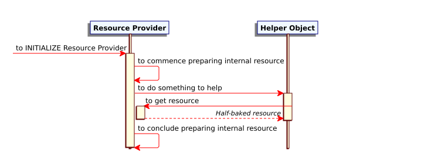
2. *A capability is required "simultaneously" by two capabilities (where at least one is non-blocking) and the one steals the promised resource, starving the other which may not be fulfilled, or corrupts a shared resource in the middle of it being consumed by the other, etc.*


Undisciplined resource competition is typically a symptom of structural design flaws, rather than the problem! There is nothing wrong with competition over resources. In fact, the very art of design may often be reduced to the (peaceful or violent) resolution of competition over so many resources. Where the resources are there for the picking, no competition involved, there is little scope for pre-design. (Just pick them up!)

##### 4.3.2.4. Collapsing

At last, we must come to terms with the fact that what we see is never the composite fact "itself" (which is an abstract), but a visualization of it in some format. And this includes the generic "indented list" snippet form, used all over this document, and parsed by Protonabu. In fact, we have already witnessed some of the limitations of the indented-list capability-only format, such as its inability to take conditions without inflecting the very fact beyond recognition.

"*Composite* fact" is a fragile structure, depending on one key property: in a composite fact, specific facts are optionally *hidden* out of sight (of the composite consumer) below their header fact! (i.e., the consumer is allowed to ignore the specifics, if the header fact is still providing the result). In order to emphasize this, the *visualized* hierarchy may *collapse* and *expand* them at will. (Also: “fold” and “unfold”).

|  |  |
| ------------------ | ----------------- |

*In the left-side visual, "to design the solution" has been collapsed. The user is invited to expand it back by pressing the "plus" icon. In the right-side visual, it is expanded (but its top two branches are still collapsed). The user is invited to collapse it by pressing the "minus" icon.*

Although "to define the requirements" is properly specified by 1) "to understand need(s)" and 2) “to model the problem domain”, getting down to these specifics it is not essential in order to agree - or disagree - whether "to define the requirements" is indeed needed in order "to develop software" (although it may offer some insight. For example, it may serve to clarify that, in the present context, "to define the requirements" actually means something other than what we had in mind). 

The conditions that may - or may not - require to expand the sub-hierarchy in the current visualization have nothing to do with the fact. Composite facts are born neither collapsed nor expanded. The best we can do is to somehow indicate visually that the present *visualized* composite fact either 1) may be expanded (because it has been collapsed), or 2) may be collapsed (for evident reasons), or 3) none of these apply. 

And then, at some iteration of the design we may *discover* that e.g., the fact “to model the problem domain”, which has seemed atomic and taken for granted, may actually be specified by some capabilities that have not been apparent (or relevant, or worthwhile) thus far. For example, “to identify use case(s)”, “to identify business entity(s)” and “to associate between business entities”. 

Expansion, although physically augmenting a (visualized) composite fact, shall have no effect on its utility! 

In a *robust and useful* design, those users of the fact base that have been taking the capability “to model the problem domain” for granted, e.g., proceeding with its guaranteed result, say, a "Business Need Analysis Document" - obviously, the “Modelers of the Solution” - may continue to take it for granted, regardless of the expansion. They are not required to consult the suddenly-exposed content of the neighboring branch, in order to continue performing their designated task. This sub-composite fact may continue to be safely collapsed in their _working visual_. If you are a Modeler of the Design, and you have been used to count on the specification document provided by the neighboring “Problem Domain Model”, then you expect to be able to continue to employ this artifact, regardless of 1) the illumination that someone else may have just had as to how it really works, and 2) even if the Modelers of the Problem Domain have decided on their own to revise their work process. (And if you can't, then we are already dealing with another product. The whole system must be broken apart, cleaned, reevaluated, greased, reassembled and re-tested, accompanied by fresh blueprint and user manuals).

The philosophical issue of whether a composite fact, visualized in expanded or collapsed form, is still "the same" fact (similar to whether one can bath twice in the same river, as in collapsing a branch and re-expanding it, only to get a different-looking branch) - as well as the engineering issue of how much change does it take to make it a new product -  is beyond the present scope. We happen to be living in a digital *solution* domain where one can expand and collapse the visualization of a composite fact on the client side (e.g., by pressing an adjacent plus/minus icon, as in the example above), without having to ponder whether the request is materializing a new composite hierarchy on the server side or is just filtering an existing and stable hierarchy that we cannot see. Among other things, because *we*, on the client side, are aware of being restricted to a replica - a representative substitute - to begin with!

It is not surprising that collapsing is one of the least stable aspects of the composite fact architecture. (When you press that "plus" icon, you open Pandora's box). For all we know, recursion is a recent language development, and its evolution is apparently far from complete!

##### 4.3.2.5. Coupling

The order of facts in a sub-composite (“horizontal” ordering, left/right rendering) is definitive - unless demonstrated otherwise. Each fact establishes the potential _preconditions_ for the facts that follow in the sub-hierarchy (but not vice-versa)! 


*The capability to build My Fact-base feeds the capability to Use My Fact-base with "My DOM class definitions". Consequently, it may only precede it, and may not be preceded by the latter*

For all we know, “to understand need(s)” is *precondition* for “to model the problem domain” (because it precedes it structurally). But “to model the problem domain” is by no means precondition for “to understand need(s)” (because it succeeds it). For example, assuming that a composite fact is typically established by a designated _process_ (which is not essential, but is common enough), then we may say that the process of “modeling the problem domain” is not fulfilled (i.e., cannot _terminate_ successfully and report back home) before all pending needs have been understood, or at least dismissed for a reason! (Otherwise, the “problem domain model” builds on a shaky - or altogether missing - foundation, and we are justified in dismissing it as practically unfulfilled, regardless of its owner's testimony).

*(“Modeling the problem domain” is a synthetic title for the use case that establishes “the problem domain model”, which is the synthetic product of the capability “to model the problem domain”)*

### 4.3.3. Conditions for fulfillment

Conditional fulfillment is a layer of detail added to composite *requirements* (specification of need).

##### 4.3.3.1. Functional escape

There are two exceptions to the *specification* paradigm (i.e., that it takes - at least considering - *all* the facts indented below to fulfill the header fact above): 1) some composite facts may be only partially fulfilled (by their sub-facts) and still be done (i.e., *practically* fulfilled), and 2) some composite facts may abort (and be either left unfulfilled or somehow remedied), due to a sub-fact misfire. 

*For example, the following sequential obstacle course of checks and double-checks is typical of embedded systems:*

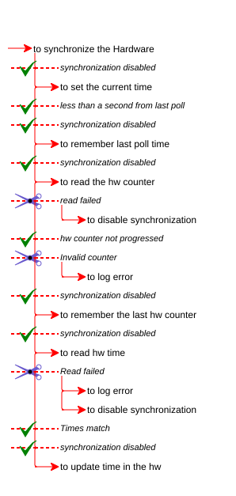

*"To synchronize the hardware" ultimately requires "to update time in the hw", (trivial assignment of value to an hardware address) culminating an obstacle-course of checks and double checks, each of which may render the remainder redundant. The green "done" mark - as in "synchronization disabled" (to begin with), or "less than a second from last poll" - prevents - not only the fulfillment, but the very present existence - of the rest of the facts, whatever they may be. The mission is accomplished (this time) without them. (Never mind that we have not physically done much. The time in the hardware is accurate, as required, so mission accomplished). The scissors (as in "read failed" or "invalid counter") indicate mission aborted, rendering the fulfillment of the remaining facts not only unnecessary, but probably hazardous (e.g., trying to access non-existent resources). What to do about it is the responsibility of the requiring, whoever that may be.*

*The escape when "Synchronization disabled" repeats multiple times, due to possible intervention by other processes, running in parallel.*

##### 4.3.3.2. Conditions and arguments

When needs grow to become requirements, the mere hierarchical structure is often not enough, inviting refinement. For example: is a sub-fact always needed in order to specify its parent fact? Is fulfilling it once enough or does it takes multiple attempts? How do we know that the sub-fact has indeed been fulfilled? What information must be provided for the sub-task to be fulfilled properly? Do we get something material in return? Some of these conditions (like iteration - how many times, if at all) refine features that have already been suggested by the composite need, some (like option) expose conditions that may be inherent in the composite need but we so far could do without. 

We can do without most of the the conditions (let alone iteration) in the conception phase, because conditions are not part of the fact - they are part of the (fact of the) fact's position in the hierarchy. (While both branches and fruit are part of the tree from which we must obtain the fruit, it is the fruit we are after). In addition, the same fact may repeat in the hierarchy, where in each position it is adorned with other conditions. (And it is still the same fact. The multiplicity is of how, when and why it is needed). In a composite requirement, the fact is of Capability (which may be referenced as much as it takes) and its hierarchical position is the fact of Requirement (by another Capability). 

While Nabu, in conformance with the programmatic paradigm, unifies repeated requirements - A (B, C) and A (B, D) are unified into A (B, C, D) because there is only one requirement A (B) - it respects *different* requirements of the same capability, such as A (C) and B (C). (And it considers A (B) and A (conditionally B) as different requirements).

While the syntax of conditioning facts is highly domain-specific, here are four condition types that are common in the software industry (and are therefore supported by Nabu):

1. Some facts are _optional_. Under some *conditions*, the fact above may be fulfilled without fulfilling *them*. For example, some software design challenges are so elementary, as to allow “to model the solution domain” without “to apply (a single) design pattern”. While this is rare, it is still possible that, at the end of the project, the Design Patterns Architect may fold the equipment and return home without ever seeing a single design pattern. So, the latter fact is *optional* - the product may be fulfilled without it! On the contrary, it is malpractice “to implement the solution” without providing at least some facilities “to test the solution” (i.e. unit tests). So the latter is *mandatory* (which also happens to be the default). The product will not be fulfilled without it!
2. Some facts are _alternative_ (also “mutually exclusive”). The sub-composite specifies a sequence of facts, exactly one of which will be sufficient to fulfill the fact above (and in each such case, none of the others). While each alternative in the sequence is "optional" (in the sense that it may - or may not - be required to fulfill), it is not optional in the sense of always being consulted before use. An alternative list is preemptive. The first alternative to fire cancels the (current) existence of the rest.
3. Some facts are _iterative_. (Which was already noted in the simple composite need). The use case needed to establish the fact must be repeated as much as necessary to (finally) fulfil the fact *above*. A private case of iteration is *scanning* a sequence of objects (silently requiring the capability to retrieve the next object, as long as there is one, i.e. an “Iterator” pseudo-capability).
4. In a _procedural_ composite fact (e.g., design for a “procedural” programming language), where facts are _blocking_ by default, some facts may be _non-blocking_. The mechanism implementing the capability is *launched* and proceeds in its own separate way in the background. Fulfilling the non-blocking fact is _not_ precondition for attempting to fulfill the next requirement or to successfully fulfill the header requirement, resulting in a number of requirements being fulfilled in "parallel". (Whatever the latter means is platform-specific - e.g., time-sharing). Since non-blocking violates the contract between requiring and required, additional requirements of technical nature are call for, to ensure that the situation does not go out of hand. E.g., inviting the non-blocking required to finally *do block* it (once everything else it requires has been fulfilled).

##### 4.3.3.3. The difference between functional escape and fact conditioning

Although functional escape may be emulated by conditioning and vice versa, they are not the same! (In the same vein that iteration may be emulated by recursion and vice versa, but they are not the same). They are different solutions addressing different problems.

While conditioning assumes the consent of the rest of the (eventually unfulfilled) sub-facts, functional escape is preemptive. You never get down to the skipped part to ask its consent in the first place. In the particular case of functional escape, the header fact is still fulfilled, oblivious to some sub-facts. But in the case of condition, each conditional fact must be visited and consulted, even if eventually not fulfilled. 

Knowing that something may be done, looking at it closely and deciding (on the spot) not to do it is one mechanism. Taking only what we need and skipping the rest without looking at it is another!

## Chapter 5. Case Study: The "Educational Site" Sample Application

To illustrate the concrete application of the Protonabu parser and schema-driven development in a complete, self-contained project, the code-base includes an **Educational Site** sample application under `protonabu/demoApp/`. 

This is a fully-functional and useful application, based upon a tool I built for myself a long time ago, for the rapid development of HTML-based lecture foils ("educational sites"). The educational site has three main use cases: 1) to project lecture foils in sequence, optionally jumping to continuation or arbitrary foils, 2) to allow the student to follow the lecture progress by browsing the site in parallel or at home (available through URL), and 3) to print the lecture foil-set as a PDF document, featuring tables of contents and cross-references. (The "to PDF" functionality is not supported in this abridged version, but is not very hard to complete, either programmatically or administratively). Also, this abridged version supports a simple straightforward write-once use case. The original version could also reverse-engineer an existing educational site foil-set and open a GUI for editing it, saving a new snippet (from which the site might be re-generated). I selected to give up this non-trivial capability, to keep the example simple.

This application parses a simple `.facts` DSL representing a lecture "Book" (comprising an hierarchy of "Chapters", "Sections", "Pages", and - inside the Page - code snippets, rows, columns, and keywords), and compiles it into a responsive "static" (predefined and server-less) HTML website with automated table-of-contents rendering, cross-referencing, and CSS styling. 

The hierarchical page structure is hard-coded and limited to four levels - Book / Chapter / Section / Page - which is sufficient for most purposes. It would not be technically challenging to allow a multi-level user-defined recursive architecture (e.g., allowing Sections under Sections, but - in all my years of teaching - I have never found the need to justify the complexity.

### 5.1. Grammar and Schema Definition

The language is governed by the schema defined in `schema.facts`:

```text
// Educational Site Generator - Protonabu Schema
// Grammar for an educational site

__SCHEMA_SECTION__: TOKENS

BOOK: quotedName
    AUTHOR: quotedName
    VERSION: quotedName
    DATE: quotedName
    LOGO: quotedText
    CHAPTER: quotedName
        DESCRIPTOR: quotedText?
        PREFIX: quotedName?
        SECTION: quotedName
            DESCRIPTOR: quotedText?
            PREFIX: quotedName?
            CROSS REFERENCE
            PAGE: quotedName
                CAPTION: quotedText?
                PREFIX: quotedName?
                HEADER: quotedText
                TEXT: quotedText
                EMPHASIZED: quotedText
                CODE: quotedText
                CAPTION LABEL: quotedText
                IMAGE: quotedText
                    ALT: quotedText?
                KEYWORD [quotedName]: quotedName
                CONTINUATION
                    HEADER: quotedText
                        __DITTO__: BOOK / CHAPTER / SECTION / PAGE / HEADER
                    TEXT: quotedText
                        __DITTO__: BOOK / CHAPTER / SECTION / PAGE / TEXT
                    EMPHASIZED: quotedText
                        __DITTO__: BOOK / CHAPTER / SECTION / PAGE / EMPHASIZED
                    CODE: quotedText
                        __DITTO__: BOOK / CHAPTER / SECTION / PAGE / CODE
                    CAPTION LABEL: quotedText
                        __DITTO__: BOOK / CHAPTER / SECTION / PAGE / CAPTION LABEL
                    IMAGE: quotedText
                        __DITTO__: BOOK / CHAPTER / SECTION / PAGE / IMAGE
                    KEYWORD [quotedName]: quotedName
                        __DITTO__: BOOK / CHAPTER / SECTION / PAGE / KEYWORD
                ROW
                    CELL
                        HEADER: quotedText
                            __DITTO__: BOOK / CHAPTER / SECTION / PAGE / HEADER
                        TEXT: quotedText
                            __DITTO__: BOOK / CHAPTER / SECTION / PAGE / TEXT
                        EMPHASIZED: quotedText
                            __DITTO__: BOOK / CHAPTER / SECTION / PAGE / EMPHASIZED
                        CODE: quotedText
                            __DITTO__: BOOK / CHAPTER / SECTION / PAGE / CODE
                        CAPTION LABEL: quotedText
                            __DITTO__: BOOK / CHAPTER / SECTION / PAGE / CAPTION LABEL
                        IMAGE: quotedName
                            __DITTO__: BOOK / CHAPTER / SECTION / PAGE / IMAGE
                        KEYWORD [quotedName]: quotedName
                            __DITTO__: BOOK / CHAPTER / SECTION / PAGE / KEYWORD
```

#### Key Grammatical Highlights:

1.  **Strong Typing**: Trailing types like `quotedName` and `quotedText` specify exactly how each fact's arguments are tokenized and checked. Postfix `?` modifiers (e.g. `DESCRIPTOR: quotedText?`) indicate optional argument (i.e., it may be missing).
2.  **Modifiers**: The `KEYWORD [quotedName]: quotedName` rule utilizes a label modifier to classify the keyword category (e.g., `[Defined]`, `[Syntax]`, `[Referenced]`) alongside the keyword argument itself.
3.  **Subtree Recursion via `__DITTO__`**: To avoid defining content blocks (headers, text paragraphs, code blocks, images) repeatedly for standard pages, continuation pages, and grid layouts, the schema utilizes `__DITTO__` directives under `CONTINUATION` and `CELL` as "subroutine" to reuse the original `PAGE` children definitions.

### 5.2. Domain Object Model ("DOM")

The parsed facts are loaded into a corresponding domain object hierarchy implemented in `siteModel.py`:

*   `Book`: The top-level document, containing metadata and a list of `Chapter`s.
*   `Chapter`: Houses a list of `Section`s.
*   `Section`: Manages a list of `Page`s and collects keywords for cross-referencing.
*   `Page`: Represents an individual lecture slide (foil page). It aggregates `PageElement` content nodes, `ContinuationPage` instances, and `KeywordRef` tags.
*   `ContinuationPage`: Models overflow content pages (e.g., exercise solution, suggestions for furthe reading) lettered sequentially (e.g., page 2A, 2B).
*   `PageElement` (abstract base): Base class for polymorphic content components (`HeaderElement`, `TextElement`, `CodeElement`, `ImageElement`, `RowElement`, `CellElement`) where each one implements `renderHtml()`.

### 5.3. SiteParser: Implementation of Parser & Dispatcher hooks

The parsing layer is implemented in `siteParser.py`. It subclasses the generic `ProtonabuParser` and manages state context variables (`self.book`, `self._currentChapter`, `self._currentSection`, `self._currentPage`, etc.) to attach parsed nodes sequentially.

#### 5.3.1. Parsing Dispatcher Setup

```python
class SiteParser(ProtonabuParser):    
	def __init__(self):		
		""" to INITIALIZE Site Parser 		
		"""        
		# [Msg]: to INITIALIZE Protonabu Schema        
		# - Using: to create Protonabu Snippet From File        
		schema = ProtonabuSchema(ProtonabuSnippetFromFile(_SCHEMA_PATH))        # [Msg]: to INITIALIZE Protonabu Parser        
		super().__init__(schema, _SCHEMA_PATH.parent)        
		self.book = None        
		self._currentChapter = None        
		self._currentSection = None        
		self._currentPage = None        
		self._currentContinuation = None        
		self._dispatcher = self._initDispatch()    
	def _initDispatch(self) -> ProtonabuParseDispatcher:        
		""" to load Labeled Fact line-parsing routines        
		"""        
		# [Msg]: to INITIALIZE Protonabu Parse Dispatcher        
		dispatcher = ProtonabuParseDispatcher()        
		# [Msg]: to register Labeled-Fact line-handlers        
		dispatcher.loadHandlers(
            self.schema.labels,             
            self
        )        
        return dispatcher
```

#### 5.3.2. Sequential Construction and Design Path Lookup

When the dispatcher traverses the AST, it invokes parser callbacks. In the data-driven Educational Site, many of these callbacks instantiate model objects, update the parsing state context, and append a child to its parent.

To determine where to register a page element (which might reside under a normal page, a continuation page, or a row/column layout cell), the parser inspects the `designPath` parameter (featuring linear parse history), solving the polymorphic challenge by ad-hoc Python duck-typing:

```python
        # to retirieve parent object from the fact path
    def _addElement(self, fact, element: PageElement):
        """ to route a Page Element to its proper parent container 
        """
        # to retirieve parent object from the fact path
        parentObj = fact.designPath[-1][1]
        # [Alt]: to add Page Element to <SUBSTITUTE container>
        if hasattr(parentObj, 'addElement'):
            parentObj.addElement(element)
        # [Alt]" to add Page Element to <Continuation Page>"
        elif self._currentContinuation:
            self._currentContinuation.addElement(element)
        # [Alt]: to add Page Element to <Foil Page>
        elif self._currentPage:
            self._currentPage.addElement(element)
```

For instance, the `ROW` and `CELL` parse handlers leverage this hierarchy:

```python
    def parseRow(self, fact):
        # to INITIALIZE "Row Element"
        row = RowElement()
        # [Msg]: to route a Page Element to its proper parent container
        self._addElement(fact, row)
        return row

    def parseCell(self, fact):
        # to INITIALIZE "Cell Element"
        cell = CellElement()
        # to retirieve parent object from the fact path
        parentObj = fact.designPath[-1][1]
        # [Msg]: to add Cell to Row
        parentObj.addCell(cell)
        return cell
```

### 5.4. Website Generation & Cross-Referencing

Once the model is built, the `SiteGenerator` (in `siteGenerator.py`) executes a depth-first walk of the structure:

1.  It creates the target directories and copies static files like `styles.css`.
2.  It traverses the `Book`, `Chapter`, and `Section` instances to render the corresponding index pages (`0.html`) and navigation menus.
3.  For each `Page`, it delegates layout rendering to the polymorphic `renderHtml()` methods of its page elements.
4.  **Keyword Index & Cross-Referencing**: If `CROSS REFERENCE` is declared inside a `SECTION`, the section gathers all keyword references across its child pages using `section.collectKeywords()`. It generates a cross-reference index page (`xref.html`) linking keywords to the specific pages (or continuation page letters) where they are defined, syntax-highlighted, or referenced.

### 5.5. Running the Educational Site Generator

The application provides a command-line interface in `__main__.py` that can be run as follows:

```bash
python -m protonabu.demoApp <script.facts> <output_folder>
```

For example, in order to compile the included demo book `demo_site.facts` (specifying an AI-generated self-promoting foil set) into a local directory:

```bash
python -m protonabu.demoApp dev/src/protonabu/demoApp/example/demo_site.facts testArea/demo_site_output
```

