### Immediate directives:

(None)

### Root facts
1. BOOK

### 1. <u>BOOK</u>
- *Argument:* Quoted Name - Sequence of words, beginning with programmatic, allowing round brackets (around one or more whole words) and (the whole) optionally enclosed within single or double quotes
- *Child facts:*
    - AUTHOR
    - VERSION
    - DATE
    - LOGO
    - CHAPTER

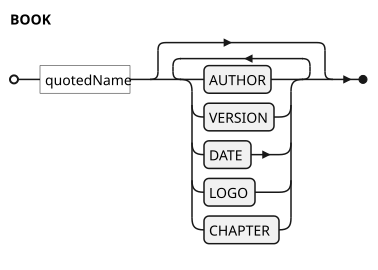

### 1.1. BOOK / <u>AUTHOR</u>
- *Argument:* Quoted Name - Sequence of words, beginning with programmatic, allowing round brackets (around one or more whole words) and (the whole) optionally enclosed within single or double quotes
- *Child facts:* (None)

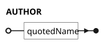

### 1.2. BOOK / <u>VERSION</u>
- *Argument:* Quoted Name - Sequence of words, beginning with programmatic, allowing round brackets (around one or more whole words) and (the whole) optionally enclosed within single or double quotes
- *Child facts:* (None)

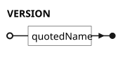

### 1.3. BOOK / <u>DATE</u>
- *Argument:* Quoted Name - Sequence of words, beginning with programmatic, allowing round brackets (around one or more whole words) and (the whole) optionally enclosed within single or double quotes
- *Child facts:* (None)

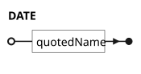

### 1.4. BOOK / <u>LOGO</u>
- *Argument:* Quoted Text - sequence of words, consisting of lower-case, upper case, digit or punctuation, excluding space and quotes and (the whole) optionally enclosed within single or double quotes
- *Child facts:* (None)

### 1.5. BOOK / <u>CHAPTER</u>
- *Argument:* Quoted Name - Sequence of words, beginning with programmatic, allowing round brackets (around one or more whole words) and (the whole) optionally enclosed within single or double quotes
- *Child facts:*
    - DESCRIPTOR
    - PREFIX
    - SECTION

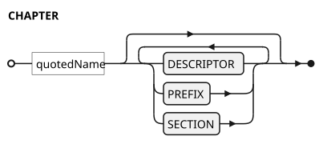

### 1.5.1. BOOK / CHAPTER / <u>DESCRIPTOR</u>
- *Argument:* Quoted Text *(optional)* - sequence of words, consisting of lower-case, upper case, digit or punctuation, excluding space and quotes and (the whole) optionally enclosed within single or double quotes
- *Child facts:* (None)

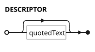

### 1.5.2. BOOK / CHAPTER / <u>PREFIX</u>
- *Argument:* Quoted Name *(optional)* - Sequence of words, beginning with programmatic, allowing round brackets (around one or more whole words) and (the whole) optionally enclosed within single or double quotes
- *Child facts:* (None)

### 1.5.3. BOOK / CHAPTER / <u>SECTION</u>
- *Argument:* Quoted Name - Sequence of words, beginning with programmatic, allowing round brackets (around one or more whole words) and (the whole) optionally enclosed within single or double quotes
- *Child facts:*
    - DESCRIPTOR
    - PREFIX
    - CROSS REFERENCE
    - PAGE

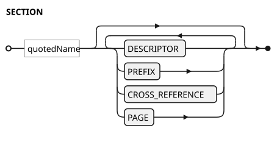

### 1.5.3.1. BOOK / CHAPTER / SECTION / <u>DESCRIPTOR</u>
- *Argument:* Quoted Text *(optional)* - sequence of words, consisting of lower-case, upper case, digit or punctuation, excluding space and quotes and (the whole) optionally enclosed within single or double quotes
- *Child facts:* (None)

### 1.5.3.2. BOOK / CHAPTER / SECTION / <u>PREFIX</u>
- *Argument:* Quoted Name *(optional)* - Sequence of words, beginning with programmatic, allowing round brackets (around one or more whole words) and (the whole) optionally enclosed within single or double quotes
- *Child facts:* (None)

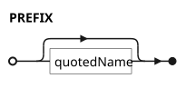

### 1.5.3.3. BOOK / CHAPTER / SECTION / <u>CROSS REFERENCE</u>
- *Child facts:* (None)

### 1.5.3.4. BOOK / CHAPTER / SECTION / <u>PAGE</u>
- *Argument:* Quoted Name - Sequence of words, beginning with programmatic, allowing round brackets (around one or more whole words) and (the whole) optionally enclosed within single or double quotes
- *Child facts:*
    - CAPTION
    - PREFIX
    - HEADER
    - TEXT
    - EMPHASIZED
    - CODE
    - CAPTION LABEL
    - IMAGE
    - KEYWORD
    - CONTINUATION
    - ROW

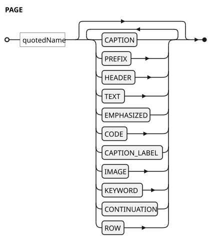

### 1.5.3.4.1. BOOK / CHAPTER / SECTION / PAGE / <u>CAPTION</u>
- *Argument:* Quoted Text *(optional)* - sequence of words, consisting of lower-case, upper case, digit or punctuation, excluding space and quotes and (the whole) optionally enclosed within single or double quotes
- *Child facts:* (None)

### 1.5.3.4.2. BOOK / CHAPTER / SECTION / PAGE / <u>PREFIX</u>
- *Argument:* Quoted Name *(optional)* - Sequence of words, beginning with programmatic, allowing round brackets (around one or more whole words) and (the whole) optionally enclosed within single or double quotes
- *Child facts:* (None)

### 1.5.3.4.3. BOOK / CHAPTER / SECTION / PAGE / <u>HEADER</u>
- *Argument:* Quoted Text - sequence of words, consisting of lower-case, upper case, digit or punctuation, excluding space and quotes and (the whole) optionally enclosed within single or double quotes
- *Child facts:* (None)

### 1.5.3.4.4. BOOK / CHAPTER / SECTION / PAGE / <u>TEXT</u>
- *Argument:* Quoted Text - sequence of words, consisting of lower-case, upper case, digit or punctuation, excluding space and quotes and (the whole) optionally enclosed within single or double quotes
- *Child facts:* (None)

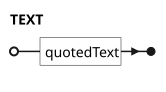

### 1.5.3.4.5. BOOK / CHAPTER / SECTION / PAGE / <u>EMPHASIZED</u>
- *Argument:* Quoted Text - sequence of words, consisting of lower-case, upper case, digit or punctuation, excluding space and quotes and (the whole) optionally enclosed within single or double quotes
- *Child facts:* (None)

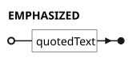

### 1.5.3.4.6. BOOK / CHAPTER / SECTION / PAGE / <u>CODE</u>
- *Argument:* Quoted Text - sequence of words, consisting of lower-case, upper case, digit or punctuation, excluding space and quotes and (the whole) optionally enclosed within single or double quotes
- *Child facts:* (None)

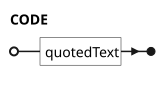

### 1.5.3.4.7. BOOK / CHAPTER / SECTION / PAGE / <u>CAPTION LABEL</u>
- *Argument:* Quoted Text - sequence of words, consisting of lower-case, upper case, digit or punctuation, excluding space and quotes and (the whole) optionally enclosed within single or double quotes
- *Child facts:* (None)

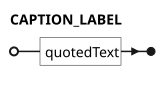

### 1.5.3.4.8. BOOK / CHAPTER / SECTION / PAGE / <u>IMAGE</u>
- *Argument:* Quoted Text - sequence of words, consisting of lower-case, upper case, digit or punctuation, excluding space and quotes and (the whole) optionally enclosed within single or double quotes
- *Child facts:*
    - ALT

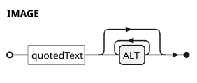

### 1.5.3.4.8.1. BOOK / CHAPTER / SECTION / PAGE / IMAGE / <u>ALT</u>
- *Argument:* Quoted Text *(optional)* - sequence of words, consisting of lower-case, upper case, digit or punctuation, excluding space and quotes and (the whole) optionally enclosed within single or double quotes
- *Child facts:* (None)

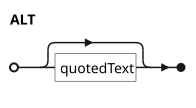

### 1.5.3.4.9. BOOK / CHAPTER / SECTION / PAGE / <u>KEYWORD</u>
- *Label modifier:* Quoted Name - Sequence of words, beginning with programmatic, allowing round brackets (around one or more whole words) and (the whole) optionally enclosed within single or double quotes
- *Argument:* Quoted Name - Sequence of words, beginning with programmatic, allowing round brackets (around one or more whole words) and (the whole) optionally enclosed within single or double quotes
- *Child facts:* (None)

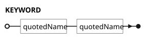

### 1.5.3.4.10. BOOK / CHAPTER / SECTION / PAGE / <u>CONTINUATION</u>
- *Child facts:* (None)

- *Available composite fact:*
    - BOOK / CHAPTER / SECTION / PAGE / HEADER
    - BOOK / CHAPTER / SECTION / PAGE / TEXT
    - BOOK / CHAPTER / SECTION / PAGE / EMPHASIZED
    - BOOK / CHAPTER / SECTION / PAGE / CODE
    - BOOK / CHAPTER / SECTION / PAGE / CAPTION LABEL
    - BOOK / CHAPTER / SECTION / PAGE / IMAGE
    - BOOK / CHAPTER / SECTION / PAGE / KEYWORD

### 1.5.3.4.11. BOOK / CHAPTER / SECTION / PAGE / <u>ROW</u>
- *Child facts:*
    - CELL

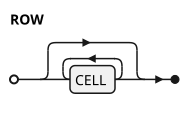

### 1.5.3.4.11.1. BOOK / CHAPTER / SECTION / PAGE / ROW / <u>CELL</u>
- *Child facts:* (None)

- *Available composite fact:*
    - BOOK / CHAPTER / SECTION / PAGE / HEADER
    - BOOK / CHAPTER / SECTION / PAGE / TEXT
    - BOOK / CHAPTER / SECTION / PAGE / EMPHASIZED
    - BOOK / CHAPTER / SECTION / PAGE / CODE
    - BOOK / CHAPTER / SECTION / PAGE / CAPTION LABEL
    - BOOK / CHAPTER / SECTION / PAGE / IMAGE
    - BOOK / CHAPTER / SECTION / PAGE / KEYWORD

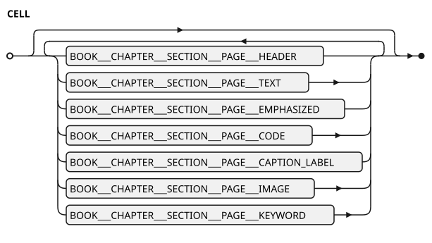

